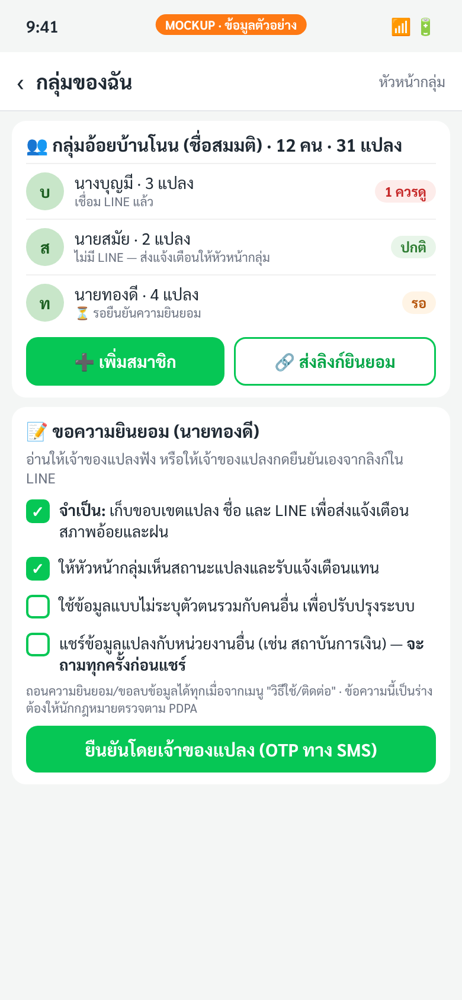
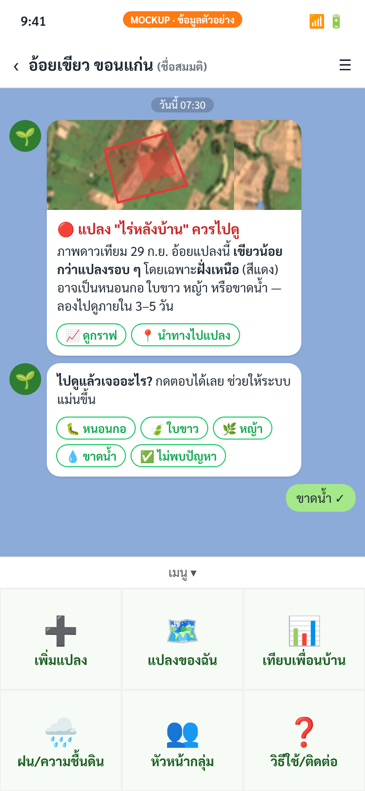
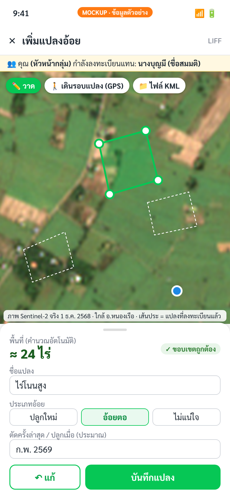
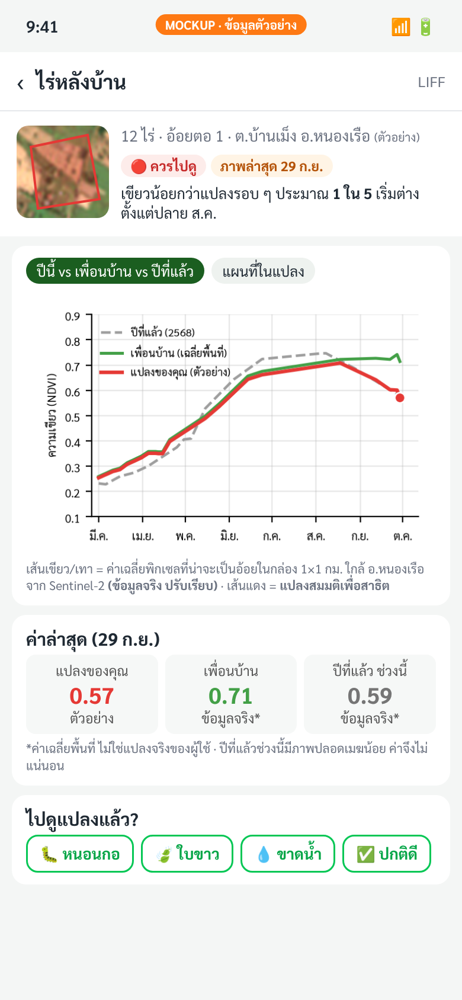
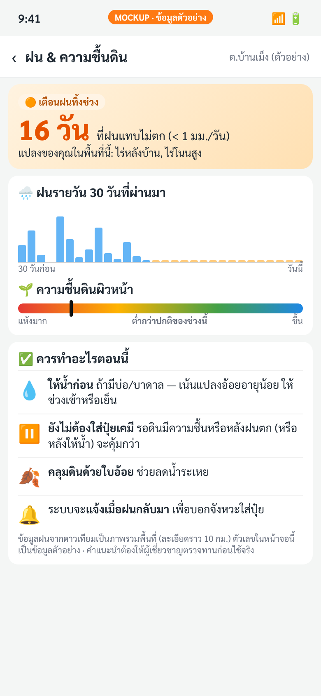
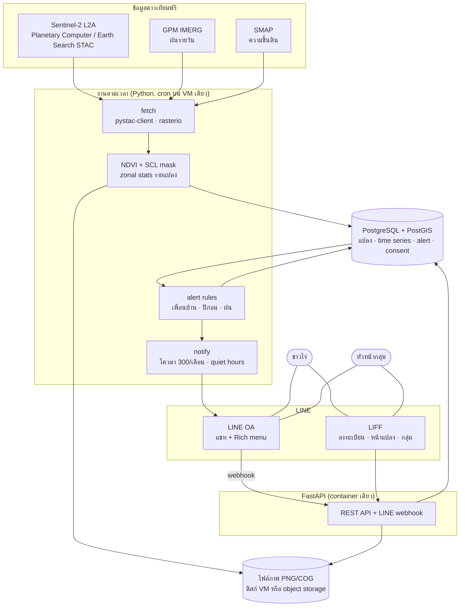

# อ้อยเขียว: แพลตฟอร์มดาวเทียมสำหรับชาวไร่อ้อย (ฉบับเกษตรกรเท่านั้น)

**เอกสารออกแบบระบบ + ขอบเขต MVP — โครงการนำร่อง จ.ขอนแก่น (อ.หนองเรือ / อ.มัญจาคีรี)**

| รายการ | รายละเอียด |
|---|---|
| ผู้อ่านหลัก | Sam (GitHub: `rungruang-ops`) |
| สถานะ | ร่าง v0.1 — 4 ต.ค. 2569 (2026) |
| ต่างจากฉบับก่อนอย่างไร | ฉบับนี้ **ไม่มีโรงงานน้ำตาลเป็นลูกค้าหรือพาร์ตเนอร์** — ผู้ใช้คือชาวไร่และหัวหน้ากลุ่มเท่านั้น (ฉบับโรงงานอยู่ที่ [`mill-version/design.md`](mill-version/design.md)) |
| ชื่อ "อ้อยเขียว" | ชื่อสมมติสำหรับเอกสาร/ภาพตัวอย่าง |

> ตัวเลขค่าใช้จ่าย เกณฑ์ (threshold) และเป้าหมายในเอกสารนี้เป็น **ค่าประมาณหรือค่าตั้งต้นสำหรับปรับจูน** เว้นแต่ระบุแหล่งที่มา ภาพหน้าจอทั้งหมดเป็น **ภาพจำลอง (mockup)** — ค่า NDVI ที่เป็น "ข้อมูลจริง" มาจาก Sentinel-2 ของกล่องพื้นที่ 1×1 กม. ใกล้ อ.หนองเรือ (ค่าเฉลี่ยพื้นที่ ไม่ใช่แปลงจริงของใคร) ส่วนเส้น "แปลงของคุณ" เป็นข้อมูลสมมติ

---

## 1. สรุปสั้น (TL;DR)

- **ใครใช้:** ชาวไร่อ้อยรายย่อยที่ใช้ LINE และ **หัวหน้ากลุ่ม/ผู้นำชุมชน** ที่ช่วยลงทะเบียนแปลงแทนสมาชิก
- **MVP มี 3 อย่างเท่านั้น:**
  1. **แจ้งเตือนทาง LINE เมื่อแปลง "เขียวน้อยกว่าเพื่อนบ้าน"** → ชวนไปตรวจแปลง
  2. **เตือนฝนทิ้งช่วง + คำแนะนำจังหวะให้น้ำ/ใส่ปุ๋ย**
  3. **หน้าเทียบแปลงตัวเองกับเพื่อนบ้านและกับปีก่อน** (กราฟแบบเดียวกับกราฟขอนแก่นที่ทำไว้)
- **ตัดออก:** คิวตัด/ค่าความหวาน CCS, ประมาณการผลผลิตทั้งพื้นที่ — เพราะต้องใช้ข้อมูลจากโรงงาน
- **สองเรื่องที่ยากขึ้นเมื่อไม่มีโรงงาน:** (1) **รายได้** — ชาวไร่ไม่ค่อยจ่ายรายเดือน (2) **การเข้าถึงชาวไร่** — ไม่มีฝ่ายส่งเสริมของโรงงานช่วยพาเข้า
- **แผน:** เริ่ม **ฟรี** กับชาวไร่ 30–50 ราย 3 เดือน → เก็บหลักฐานว่ามีประโยชน์ → ค่อยไปคุยกับผู้จ่ายเงิน (ร้านปัจจัยการผลิต, ประกัน, ธ.ก.ส., โครงการรัฐ หรือโรงงานในภายหลัง)
- **ต้นทุนต่ำมาก:** ข้อมูลดาวเทียมฟรีทั้งหมด, LINE OA แพ็กเกจ Free (300 ข้อความ/เดือน) น่าจะพอสำหรับ 30–50 ราย ถ้าคุมจำนวน push (ดูข้อ 8)

---

## 2. ทำไมฉบับเกษตรกรเท่านั้นจึงต่างออกไป

| ประเด็น | ฉบับมีโรงงาน | ฉบับเกษตรกรเท่านั้น (ฉบับนี้) |
|---|---|---|
| ผู้จ่ายเงิน | โรงงาน (B2B) | ยังไม่มีชัดเจน → ต้องพิสูจน์คุณค่าก่อน แล้วหาผู้จ่ายทางอ้อม (ข้อ 10) |
| ช่องทางเข้าถึงชาวไร่ | ฝ่ายส่งเสริม/หัวหน้าโควตา | หัวหน้ากลุ่ม, สหกรณ์/วิสาหกิจชุมชน, ร้านปุ๋ย-ยาในตำบล (ข้อ 11) |
| ข้อมูลขอบเขตแปลง | ขอจากโรงงานได้ | ต้องวาดเองทุกแปลง → onboarding ต้องง่ายมาก |
| ข้อมูล CCS/ผลผลิตจริง | มี | ไม่มี → ตัดฟีเจอร์คิวตัด/CCS/ประมาณผลผลิต |
| ความเชื่อใจ | ชาวไร่อาจกลัวโรงงานเห็นข้อมูล | ง่ายกว่า: ข้อมูลเป็นของชาวไร่ ไม่แชร์ใครโดยไม่ถาม |
| ความซับซ้อนระบบ | multi-tenant, แดชบอร์ดโรงงาน | ไม่มีแดชบอร์ดโรงงาน — มีแค่หน้า "กลุ่มของฉัน" ใน LIFF สำหรับหัวหน้ากลุ่ม |

---

## 3. ผู้ใช้และเพอร์โซนา

### 3.1 เพอร์โซนา A — "ลุงสมาน" ชาวไร่มีสมาร์ทโฟน ทักษะดิจิทัลน้อย *(ตัวละครสมมติ)*
- ปลูกอ้อยน้ำฝนไม่กี่แปลง ใช้ LINE คุยกับลูกหลาน ดูวิดีโอได้ แต่ไม่ถนัดพิมพ์หรือใช้แผนที่
- ต้องการ: รู้ว่า **แปลงไหนควรไปดู** และ **ช่วงนี้ควรใส่ปุ๋ย/ให้น้ำหรือยัง** โดยไม่ต้องเรียนรู้แอปใหม่
- ข้อจำกัด: อ่านข้อความยาวไม่ไหว, กดปุ่มได้แต่ไม่ชอบกรอกฟอร์ม, อาจไม่เชื่อ "ดาวเทียม" จนกว่าจะเห็นว่าตรงกับของจริง
- ดีไซน์ที่ตอบโจทย์: ข้อความสั้น มีภาพแปลงพร้อมจุดสีแดง, ปุ่มตอบกลับแบบกดเดียว, ไม่ต้องวาดแปลงเอง (หัวหน้ากลุ่มทำให้)

### 3.2 เพอร์โซนา B — "พี่หน่อย" หัวหน้ากลุ่ม/ผู้นำกลุ่มชาวไร่ *(ตัวละครสมมติ)*
- คล่องสมาร์ทโฟน เป็นคนประสานงานในหมู่บ้าน (เช่น กลุ่มชาวไร่, วิสาหกิจชุมชน, อสม., ผู้ใหญ่บ้าน หรือเจ้าของรถตัด)
- ต้องการ: ช่วยสมาชิกโดยไม่เสียเวลามาก, อยากเห็นภาพรวมแปลงทั้งกลุ่ม, ได้รับการยอมรับในชุมชน
- บทบาทในระบบ: **ลงทะเบียนแปลงแทนสมาชิก**, ขอความยินยอม, รับแจ้งเตือนแทนสมาชิกที่ไม่มี LINE, ส่งต่อคำแนะนำ
- แรงจูงใจที่เป็นไปได้ (ต้องทดสอบ): ได้สิทธิ์ใช้ฟีเจอร์กลุ่ม, ได้รับการยกย่อง/ใบประกาศ, ค่าตอบแทนเล็กน้อยต่อแปลงที่ลงทะเบียนสำเร็จ (ถ้ามีงบ)

### 3.3 เพอร์โซนา C — "น้องเบียร์" ลูกหลานชาวไร่ *(ตัวละครสมมติ)*
- ทำงานในเมือง แต่ช่วยพ่อแม่ดูแลไร่ทางไกล
- เป็น "ผู้ดูแลร่วม" ของบัญชีพ่อแม่ได้ → รับแจ้งเตือนคู่กัน, ช่วยวาดแปลงจากที่ไกล

### 3.4 ผู้ใช้ที่ไม่ใช่เป้าหมายใน MVP
- โรงงานน้ำตาล, ธนาคาร, ประกัน, หน่วยงานรัฐ — เป็น **ผู้จ่ายเงิน/พาร์ตเนอร์ในอนาคต** ไม่ใช่ผู้ใช้ระบบใน MVP

---

## 4. User journeys

### 4.1 Journey 1 — หัวหน้ากลุ่มลงทะเบียนสมาชิก (onboarding ผ่านกลุ่ม)
1. ทีมงานจัดประชุมสั้นกับกลุ่มชาวไร่ (ที่ศาลาหมู่บ้าน/ร้านปุ๋ย) สาธิตกราฟเทียบแปลงจากข้อมูลจริงของพื้นที่
2. หัวหน้ากลุ่มเพิ่มเพื่อน LINE OA → เมนู **"หัวหน้ากลุ่ม"** → สร้างกลุ่ม
3. กด **"เพิ่มสมาชิก"** → ใส่ชื่อ + เบอร์โทร → ระบบส่ง **ลิงก์ความยินยอม** ให้สมาชิก (ทาง LINE หรือ SMS OTP ถ้าไม่มี LINE)
4. สมาชิกกดยืนยันความยินยอม (หรือหัวหน้ากลุ่มอ่านให้ฟังแล้วสมาชิกกรอก OTP ที่ได้รับเอง)
5. หัวหน้ากลุ่มเปิด LIFF **"เพิ่มแปลง"** ในนามสมาชิก → วาดแปลงบนภาพดาวเทียม (หรือเดินรอบแปลงด้วย GPS) → เลือกอ้อยปลูกใหม่/อ้อยตอ + เดือนที่ตัด/ปลูกโดยประมาณ → บันทึก
6. ระบบดึงภาพย้อนหลัง 3 ปีของแปลง → ภายใน 1 วัน สมาชิกได้ข้อความ "แปลงของคุณพร้อมแล้ว" + ลิงก์ดูกราฟเทียบเพื่อนบ้าน/ปีก่อน (= "aha moment" แรก)

### 4.2 Journey 2 — ได้รับแจ้งเตือนแปลงเขียวน้อยกว่าเพื่อนบ้าน
1. ดาวเทียมผ่าน → ระบบพบว่าแปลง "ไร่หลังบ้าน" เขียวน้อยกว่าเพื่อนบ้านติดต่อกัน 2 ภาพ
2. ส่งข้อความ LINE 07:30 น. พร้อมภาพแปลงที่ระบายส่วนผิดปกติเป็นสีแดง (ส่งถึงหัวหน้ากลุ่มด้วย ถ้าสมาชิกยินยอม)
3. ลุงสมานกด **"นำทางไปแปลง"** → ไปดู → กดตอบ **"ขาดน้ำ"** / **"หนอนกอ"** / **"ไม่พบปัญหา"**
4. ระบบบันทึกเป็น feedback → ใช้วัดความแม่นและปรับเกณฑ์
5. 7 วันหลังจากนั้น ถ้ายังไม่ตอบ ระบบถามซ้ำ 1 ครั้ง (reply-based ถ้าผู้ใช้ทักมา เพื่อประหยัดโควตา)

### 4.3 Journey 3 — ฝนทิ้งช่วง
1. ฝนในตำบลน้อยกว่า 1 มม./วัน ต่อเนื่อง 14+ วัน และความชื้นดินต่ำกว่าปกติ
2. ส่งข้อความ "เตือนฝนทิ้งช่วง" ถึงทุกคนที่มีแปลงในตำบล (1 ข้อความต่อคน ไม่ใช่ต่อแปลง)
3. คำแนะนำ: ให้น้ำก่อน (ถ้ามีแหล่งน้ำ), เลื่อนใส่ปุ๋ยเคมี, คลุมดิน
4. เมื่อฝนกลับมา (ฝนสะสมพอ) ส่งข้อความ **"ฝนมาแล้ว — จังหวะดีสำหรับใส่ปุ๋ย"** → ปิด loop ทำให้ข้อความแรกมีความหมาย

### 4.4 Journey 4 — เข้ามาดูเอง (pull ไม่ใช่ push)
- กดเมนู **"เทียบเพื่อนบ้าน"** หรือ **"แปลงของฉัน"** → เปิดหน้าแปลงใน LIFF → ดูกราฟปีนี้ vs เพื่อนบ้าน vs ปีที่แล้ว
- การตอบกลับแบบนี้ใช้ **reply message / LIFF** ซึ่ง **ไม่นับโควตา push** → ส่งเสริมให้ผู้ใช้ "เข้ามาดู" มากกว่าให้ระบบ "ส่งไปหา"

---

## 5. ฟีเจอร์ MVP โดยละเอียด

### 5.1 F1 — แจ้งเตือน "เขียวน้อยกว่าเพื่อนบ้าน"

**อินพุต:** Sentinel-2 L2A (รอบประมาณ 5 วัน, 10 ม.)

**ขั้นตอนประมวลผลต่อภาพ** (เหมือนฉบับก่อน ย่อให้เบาลง):
1. อ่าน B04, B08, SCL เฉพาะ bbox ของพื้นที่นำร่อง (ไม่ดาวน์โหลดทั้ง scene)
2. **Cloud mask ด้วย SCL** — เก็บเฉพาะ class 4 (vegetation) และ 5 (not vegetated) — แบบเดียวกับที่ใช้ทำกราฟขอนแก่น; ขยายขอบเมฆ/เงาเมฆ 1–2 พิกเซล
3. ปรับ offset ค่าสะท้อน (processing baseline ≥ 04.00 ต้องลบ 1000) ให้สม่ำเสมอข้ามปี
4. NDVI = (B08 − B04) / (B08 + B04)
5. ค่ามัธยฐาน NDVI รายแปลง โดยหดขอบแปลงเข้า 10 ม. (ลดพิกเซลปนกับคันนา/ถนน); ใช้ได้เมื่อพิกเซลปลอดเมฆ ≥ 60% และ ≥ 4 พิกเซล

**"เพื่อนบ้าน" คือใคร (ปัญหาเฉพาะของฉบับเกษตรกร):** ช่วงแรกมีแปลงลงทะเบียนน้อย → จะหาแปลงเพื่อนบ้านที่ลงทะเบียนไว้ ≥ 8 แปลงได้ยาก จึงใช้ **"พิกเซลที่น่าจะเป็นอ้อย" รอบแปลง** แทน:
- นิยาม (เหมือนกราฟขอนแก่น): พิกเซลที่เป็น cropland ใน ESA WorldCover 2021 และมี NDVI > 0.6 ในภาพช่วงต้นธันวาคม (หลังเกี่ยวข้าว ก่อนเปิดหีบ) — **เป็นการประมาณ ไม่ใช่แผนที่อ้อยที่ยืนยันแล้ว** ต้องอัปเดตทุกฤดู
- กลุ่มเพื่อนบ้าน = พิกเซลอ้อยในวงรัศมี 2–3 กม. รอบแปลง (ไม่รวมแปลงตัวเอง) ใน **ภาพเดียวกัน**
- เมื่อมีแปลงลงทะเบียนมากพอ (≥ 8 แปลงในรัศมี 5 กม. อายุอ้อยใกล้กัน ±45 วัน) ให้ใช้แปลงจริงแทน

**กฎตัดสิน (ค่าตั้งต้น ปรับได้):**

| ตัวชี้วัด | สูตร |
|---|---|
| ส่วนต่างเทียบเพื่อนบ้าน | `gap_nb = (ndvi_plot − median_nb) / median_nb` |
| robust z เทียบเพื่อนบ้าน | `z_nb = (ndvi_plot − median_nb) / (1.4826 × MAD_nb)` |
| เทียบปีก่อนช่วงเดียวกัน | `z_hist` = เทียบค่าของแปลงเดียวกันในหน้าต่าง ±10 วันของ 2–3 ปีก่อน (ถ้ามีภาพพอ) |

- 🔴 **ส่ง LINE** เมื่อ `gap_nb ≤ −15%` **และ** `z_nb ≤ −2` **ติดต่อกัน 2 ภาพที่ใช้ได้** (ภาพห่างกันไม่เกิน 20 วัน)
- 🟡 **แสดงในหน้าแปลงเท่านั้น (ไม่ push):** เข้าเงื่อนไขครั้งเดียว หรือ `z_hist ≤ −1.5`
- **ไม่แจ้ง:** อ้อยอายุ < 60 วันหลังปลูก/ตัด, ช่วงเปิดหีบ (โดยทั่วไป ธ.ค.–เม.ย.) ที่ NDVI ลดฮวบทั้งแปลง → ถาม "ตัดแล้วหรือยัง?" แทน
- **กันแจ้งเตือนถี่:** แปลงละ ≤ 1 ครั้ง/14 วัน, ผู้ใช้ละ ≤ 2 push/สัปดาห์
- **กันเหตุระดับพื้นที่:** ถ้า > 40% ของแปลงในตำบลผิดปกติพร้อมกัน → ระงับ alert รายแปลง (น่าจะเป็นแล้ง/ปัญหาภาพ) ให้ทีมตรวจก่อน
- **การเรียนรู้:** ปุ่มตอบกลับ (หนอนกอ / ใบขาว / หญ้า / ขาดน้ำ / ไม่พบปัญหา) → คำนวณ precision รายเดือน → ปรับเกณฑ์

ตัวอย่างจากภาพจำลอง (ข้อ 7): เพื่อนบ้าน 0.71 (ข้อมูลจริงเฉลี่ยพื้นที่หนองเรือ ปลาย ก.ย. 2569 ปรับเรียบ), แปลงตัวอย่าง 0.57 (สมมติ) → `gap_nb ≈ −20%` → เข้าเกณฑ์แจ้ง

### 5.2 F2 — เตือนฝนทิ้งช่วง + จังหวะให้น้ำ/ใส่ปุ๋ย

**อินพุต:** GPM IMERG (ฝนรายวัน ~0.1° หรือราว 10 กม., รุ่น Early/Late มีความหน่วงไม่กี่ชั่วโมงถึงราววัน), SMAP (ความชื้นดินผิวหน้า ~9–36 กม. ตามผลิตภัณฑ์)

**กฎ (ค่าตั้งต้น — ต้องให้ผู้เชี่ยวชาญด้านอ้อยตรวจ):**
- **ฝนทิ้งช่วง:** ฝนรายวัน < 1 มม. ติดต่อกัน ≥ 14 วัน ในช่วงฤดูฝน หรือ ฝนสะสม 30 วัน < 40% ของค่าเฉลี่ยระยะยาวของช่วงเดียวกัน (climatology จาก IMERG ≥ 10 ปี)
- **ความชื้นดินต่ำ:** SMAP ต่ำกว่า percentile 20 ของช่วงเวลาเดียวกันในอดีต
- 🟠 ส่ง LINE เมื่อ **เข้าทั้งสองเงื่อนไข** และผู้ใช้มีแปลงอ้อยอายุน้อยหรืออยู่ในช่วงที่ต้องการน้ำมาก
- ✅ **"ฝนกลับมา"**: ฝนสะสม 3 วัน ≥ 20 มม. (ค่าตั้งต้น) หลังจากเคยเตือน → ส่งข้อความ "จังหวะดีสำหรับใส่ปุ๋ย"

**คำแนะนำ (rule-based ง่าย ๆ ไม่ใช่ AI):**

| สถานการณ์ | คำแนะนำ |
|---|---|
| ฝนทิ้งช่วง + มีแหล่งน้ำ (ผู้ใช้ตอบไว้ตอนลงทะเบียน) | ให้น้ำก่อน เน้นแปลงอ้อยอายุน้อย ช่วงเช้า/เย็น |
| ฝนทิ้งช่วง + ไม่มีแหล่งน้ำ | ยังไม่ใส่ปุ๋ยเคมี, คลุมดินด้วยใบอ้อย, กำจัดวัชพืชที่แย่งน้ำ |
| ฝนกลับมาหลังแล้ง | ใส่ปุ๋ยได้เมื่อดินมีความชื้น |
| คาดว่าจะมีฝนหนัก (เฟสถัดไปถ้าใช้พยากรณ์) | เลื่อนใส่ปุ๋ยเพื่อลดการชะล้าง |

ทุกข้อความต้องระบุว่า **"เป็นภาพรวมของพื้นที่"** และมีปุ่มให้ผู้ใช้ตอบว่า "ฝนที่แปลงตกบ้างไหม" เพื่อเทียบกับความจริง

### 5.3 F3 — หน้าเทียบแปลงกับเพื่อนบ้านและปีก่อน

- เปิดจาก Rich menu → LIFF หน้าแปลง
- กราฟเส้น 3 เส้น: **แปลงของคุณ (ปีนี้)**, **เพื่อนบ้าน (ปีนี้)**, **แปลงของคุณ (ปีที่แล้ว)** — แกน X เป็นเดือน, แกน Y ใช้คำว่า "ความเขียว" ไม่ใช่ "NDVI" (มีคำอธิบายเล็ก ๆ)
- การ์ดตัวเลขล่าสุด + สถานะ (ปกติ / เฝ้าระวัง / ควรไปดู) + วันที่ของภาพล่าสุด
- ถ้าไม่มีภาพปลอดเมฆนาน (ฤดูฝน) ให้บอกตรง ๆ ว่า "ไม่มีภาพชัดตั้งแต่วันที่ …" แทนการเงียบ
- เฟส 1.5: แผนที่ความเขียวภายในแปลง (เห็นว่าส่วนไหนของแปลงแย่)
- ข้อมูลย้อนหลังชุดนี้คือ **"ประวัติแปลง"** ที่ในอนาคตอาจใช้ประกอบการขอสินเชื่อ (เฟส 3, ต้องได้ความยินยอมเฉพาะ)

### 5.4 สิ่งที่ไม่อยู่ใน MVP

- ❌ คิวตัดอ้อย / ค่าความหวาน CCS / ประมาณการผลผลิตทั้งพื้นที่ — ต้องใช้ข้อมูลโรงงาน
- ❌ แผนที่โซนใส่ปุ๋ยแบบแปรผัน (เฟส 2 — ทำได้โดยไม่ต้องมีโรงงาน)
- ❌ ตรวจจุดความร้อน/ยืนยันอ้อยสด (เฟส 2 — มีประโยชน์ถ้ามีโครงการจูงใจที่ต้องการหลักฐาน)
- ❌ แผนที่น้ำท่วมด้วย Sentinel-1 (เฟส 2 — ประกอบการขอความช่วยเหลือ/ประกัน)
- ❌ จองรถตัดแบบกลุ่ม (เฟส 2–3 — เป็นบริการเสริมที่อาจเก็บเงินได้)
- ❌ รายงานประวัติแปลงสำหรับ ธ.ก.ส. (เฟส 3)
- ❌ แดชบอร์ดเว็บแยก, แอป native, วินิจฉัยโรค/แมลงจากดาวเทียม

---

## 6. Onboarding และความยินยอม (PDPA)

### 6.1 หลักการ
- **หัวหน้ากลุ่มเป็นช่องทางหลัก** — ชาวไร่ไม่ต้องวาดแปลงเอง
- **ความยินยอมต้องมาจากเจ้าของแปลงเอง** ไม่ใช่หัวหน้ากลุ่มกดแทน → ยืนยันผ่าน LINE (ถ้ามี) หรือ OTP ทาง SMS ไปยังเบอร์ของเจ้าของแปลง
- ข้อมูลที่เก็บถือเป็นข้อมูลส่วนบุคคลตาม **พ.ร.บ.คุ้มครองข้อมูลส่วนบุคคล พ.ศ. 2562 (PDPA)**: ชื่อ, เบอร์โทร, LINE user ID, ตำแหน่ง/ขอบเขตแปลง (ระบุตัวตนได้เมื่อรวมกับชื่อ)

### 6.2 ความยินยอมแยกตามวัตถุประสงค์

| วัตถุประสงค์ | บังคับ? | ค่าเริ่มต้น |
|---|---|---|
| เก็บขอบเขตแปลง ชื่อ LINE เพื่อส่งแจ้งเตือน | จำเป็นต่อการให้บริการ | — |
| ให้หัวหน้ากลุ่มเห็นสถานะแปลงและรับแจ้งเตือนแทน | ไม่บังคับ | ถามชัดเจน |
| ใช้ข้อมูลแบบไม่ระบุตัวตน (รวมกลุ่ม) เพื่อพัฒนาระบบ | ไม่บังคับ | ไม่ติ๊กไว้ก่อน |
| แชร์กับหน่วยงานภายนอก (สถาบันการเงิน, ประกัน, ร้านค้า) | ไม่บังคับ | **ถามทุกครั้งที่จะแชร์** แยกต่อผู้รับ |

### 6.3 สิ่งที่ต้องทำ
- Privacy notice ภาษาไทยอ่านง่าย (มีเวอร์ชันเสียง/วิดีโอสั้นสำหรับผู้สูงอายุ)
- เก็บ `consent_version`, เวลา, ช่องทางยืนยัน, ผู้ช่วยลงทะเบียน (หัวหน้ากลุ่ม) ใน audit log
- เมนูถอนความยินยอม/ขอลบข้อมูล
- เก็บเฉพาะที่จำเป็น (ไม่ต้องเก็บเลขบัตรประชาชน/เลขโควตาใน MVP)
- ให้นักกฎหมายตรวจข้อความความยินยอมก่อนเปิดใช้จริง



---

## 7. ภาพจำลองหน้าจอ (Mockups)

ทุกภาพมีป้าย **"MOCKUP · ข้อมูลตัวอย่าง"** ชื่อคน/ตำบล/บัญชี LINE เป็นชื่อสมมติ ภาพพื้นหลังแผนที่เป็นภาพ Sentinel-2 จริง (1 ธ.ค. 2568, ใกล้ อ.หนองเรือ) ส่วนแอปจริงอาจใช้ basemap ความละเอียดสูงกว่าสำหรับการวาดแปลง

| 01 · แชท LINE OA + Rich menu | 02 · LIFF ลงทะเบียนแปลงบนแผนที่ |
|---|---|
|  |  |

| 03 · หน้าแปลง: เทียบเพื่อนบ้าน & ปีก่อน | 04 · ฝน/ความชื้นดิน + คำแนะนำ |
|---|---|
|  |  |

หมายเหตุภาพ 03: เส้นเขียว (เพื่อนบ้าน) และเส้นเทา (ปีที่แล้ว) คือค่าเฉลี่ย NDVI จริงของ "พิกเซลที่น่าจะเป็นอ้อย" ในกล่อง 1×1 กม. ใกล้ อ.หนองเรือ (ปรับเรียบด้วย median 3 จุด) จากไฟล์ `khonkaen_sugarcane_ndvi_sentinel2.csv`; เส้นแดงเป็นแปลงสมมติ ส่วนตัวเลขในภาพ 04 (จำนวนวันฝนทิ้งช่วง, แท่งฝน, เกจความชื้น) เป็นข้อมูลตัวอย่างทั้งหมด

---

## 8. ตัวอย่างข้อความ LINE (ภาษาง่าย ทำตามได้)

หลักเขียน: สั้น ≤ 4 บรรทัดหลัก, บอก **"ทำอะไร"** ก่อน **"ทำไม"**, ไม่ใช้คำว่า NDVI/ดัชนี, บอกว่าดาวเทียม "ไม่รู้สาเหตุ", มีปุ่มกดเสมอ, ส่งช่วง 06:00–19:00

**8.1 แปลงเขียวน้อยกว่าเพื่อนบ้าน**
> 🔴 แปลง "ไร่หลังบ้าน" ควรไปดู
> ภาพดาวเทียม 29 ก.ย. อ้อยแปลงนี้เขียวน้อยกว่าแปลงรอบ ๆ โดยเฉพาะฝั่งเหนือ (สีแดงในรูป)
> อาจเป็นหนอนกอ ใบขาว หญ้า หรือขาดน้ำ — ลองไปดูภายใน 3–5 วัน
> [📍 นำทางไปแปลง] [📈 ดูกราฟ]
> ไปดูแล้วเจออะไร? [หนอนกอ] [ใบขาว] [หญ้า] [ขาดน้ำ] [ไม่พบปัญหา]

**8.2 เตือนฝนทิ้งช่วง**
> 🟠 ฝนไม่ค่อยตกมา 16 วันแล้ว (แถว ต.บ้านเม็ง)
> ดินแห้งกว่าปกติของช่วงนี้
> ✅ ถ้ามีน้ำ: ให้น้ำอ้อยอายุน้อยก่อน ช่วงเช้า/เย็น
> ⏸️ ยังไม่ต้องใส่ปุ๋ยเคมี รอดินชื้นก่อนจะคุ้มกว่า
> ฝนที่ไร่คุณตกบ้างไหม? [ไม่ตก] [ตกนิดหน่อย] [ตกพอ]

**8.3 ฝนกลับมา — จังหวะใส่ปุ๋ย**
> 🌧️ ฝนกลับมาแล้ว (3 วันที่ผ่านมา ฝนตกพอสมควรในพื้นที่)
> ดินน่าจะชื้นพอ — ถ้าวางแผนใส่ปุ๋ยไว้ ช่วงนี้เป็นจังหวะที่ดี
> [ดูฝนในพื้นที่]

**8.4 แปลงพร้อมแล้ว (หลังลงทะเบียน)**
> ✅ แปลง "ไร่โนนสูง" (ประมาณ 24 ไร่) พร้อมแล้ว
> ดูได้เลยว่าอ้อยปีนี้เขียวกว่าหรือน้อยกว่าเพื่อนบ้านและปีที่แล้ว
> [📈 ดูแปลงของฉัน]

**8.5 สรุปถึงหัวหน้ากลุ่ม (สัปดาห์ละครั้ง — ส่งเมื่อมีเรื่องเท่านั้น)**
> 👥 กลุ่มอ้อยบ้านโนน: สัปดาห์นี้มี 2 แปลงที่ควรไปดู (นางบุญมี 1, นายสมัย 1) และ 3 คนยังไม่ได้ตอบผลการตรวจ
> [ดูรายชื่อ]

(ชื่อบุคคล/ตำบลในตัวอย่างเป็นชื่อสมมติ คำแนะนำทางการเกษตรต้องให้ผู้เชี่ยวชาญตรวจก่อนใช้จริง)

**งบโควตาข้อความ (ประมาณการ):** 50 ราย × (แจ้งเตือนแปลง ~1–2 + ฝน ~1–2) ต่อเดือน ≈ 100–200 push/เดือน → อยู่ในโควตา **LINE OA Free 300 ข้อความ/เดือน** (ราคาไทยตามที่ LINE ประกาศ ณ ก.ย.–ต.ค. 2569; push นับต่อผู้รับ 1 คน; การตอบกลับแชทที่ผู้ใช้ทักมาไม่นับโควตา) — ถ้าขยายเกินราว 100 ราย ต้องพิจารณา Basic 1,280 บาท/เดือน (15,000 ข้อความ) หรือ Pro 1,780 บาท/เดือน (35,000 ข้อความ) ไม่รวม VAT 7% ระบบต้องมี **ตัวนับโควตา** และจัดลำดับความสำคัญ (🔴 > 🟠 > สรุปกลุ่ม) เมื่อใกล้เต็ม

---

## 9. สถาปัตยกรรม (เบากว่าฉบับโรงงาน, ต้นทุนต่ำสุด)

### 9.1 แผนภาพ




### 9.2 ส่วนประกอบ

| ส่วน | MVP ใช้อะไร | ตัดอะไรออกจากฉบับโรงงาน |
|---|---|---|
| ข้อมูล | Sentinel-2 L2A, GPM IMERG, SMAP | Sentinel-1, FIRMS (ไปเฟส 2) |
| งานประมวลผล | Python script + **cron** ใน Docker บน VM เครื่องเดียว; ใช้โค้ดเดียวกับที่ทำกราฟขอนแก่น (pystac-client + planetary-computer + rasterio อ่านเฉพาะ window) | Prefect/Dagster, dask, tile server |
| ฐานข้อมูล | PostgreSQL + PostGIS (container เดียวกันบน VM หรือ managed free tier) | partition/TimescaleDB |
| เก็บไฟล์ | PNG thumbnail รายแปลง + COG ของ AOI บนดิสก์ VM (สำรองไป object storage) | TiTiler |
| Backend | FastAPI: LINE webhook (ตรวจ `X-Line-Signature`), REST ให้ LIFF (ยืนยันตัวตนด้วย LIFF ID token) | auth แดชบอร์ด, RBAC หลายองค์กร |
| Frontend | LIFF 3 หน้า: ลงทะเบียนแปลง, หน้าแปลง (กราฟ), กลุ่มของฉัน — React/Vite หรือ Svelte + MapLibre GL JS; กราฟด้วย Chart.js หรือรูป PNG ที่ render ฝั่ง server | แดชบอร์ดโรงงานทั้งหมด |
| การแจ้งเตือน | LINE Messaging API (Flex Message + quick reply/postback) + ตัวนับโควตา | — |
| OTP สำหรับคนไม่มี LINE | ใช้บริการ SMS OTP (มีค่าใช้จ่ายต่อข้อความ — เลือกผู้ให้บริการตอนทำจริง) หรือให้ลูกหลานยืนยันผ่าน LINE | — |
| Monitoring | log + แจ้งเตือนทีมเมื่อ job ล้ม / ไม่มีภาพใหม่เกิน X วัน (ส่งเข้า LINE กลุ่มทีม) | Grafana |

### 9.3 ตารางงาน

| Job | ความถี่ | งาน |
|---|---|---|
| `s2_fetch` | ทุก 12 ชม. | หา scene ใหม่ที่ทับ AOI → NDVI + mask → stats รายแปลง + พิกเซลอ้อยเพื่อนบ้าน |
| `ndvi_rules` | หลัง `s2_fetch` | คำนวณ gap_nb, z_nb, z_hist → สร้าง alert |
| `rain_fetch` + `smap_fetch` | วันละครั้ง | ฝน/ความชื้นรายตำบล |
| `rain_rules` | วันละครั้ง | ฝนทิ้งช่วง / ฝนกลับมา |
| `notify` | ทุก 30 นาที 06:00–19:00 | ส่งตามลำดับความสำคัญภายใต้โควตา |
| `backfill_plot` | เมื่อมีแปลงใหม่ | ดึงย้อนหลัง 3 ปีให้แปลงนั้น |
| `cane_mask_refresh` | ปีละครั้ง (ต้น ธ.ค.) | อัปเดตแผนที่ "พิกเซลน่าจะเป็นอ้อย" |

### 9.4 ค่าใช้จ่าย (นำร่อง 30–50 ราย)

| รายการ | ค่าใช้จ่าย | ความมั่นใจ |
|---|---|---|
| ข้อมูลดาวเทียม | **ฟรี** (NASA ต้องมีบัญชี Earthdata ฟรี) | สูง — ข้อมูลเปิด |
| LINE OA Free | **0 บาท, 300 ข้อความ/เดือน** | สูง — ราคาที่ LINE ประเทศไทยประกาศ (ตรวจ ก.ย.–ต.ค. 2569) |
| VM เล็ก 1 เครื่อง (เช่น 2 vCPU / 4–8 GB) | **ประมาณการ: หลักร้อยถึงพันกว่าบาท/เดือน** ขึ้นกับผู้ให้บริการ | ต่ำ — ต้องเช็คราคาจริง; บางผู้ให้บริการมี free tier/เครดิตสำหรับเริ่มต้น |
| SMS OTP | **ประมาณการ: ต่อข้อความ** ใช้เฉพาะคนไม่มี LINE | ต่ำ — ต้องเช็คราคา |
| โดเมน + SSL | ค่าโดเมนรายปี + Let's Encrypt ฟรี | สูง |
| ต้นทุนที่ใหญ่ที่สุดจริง ๆ | **เวลาคน** ลงพื้นที่ onboarding และตอบคำถาม | — |

---

## 10. Data model (ตารางหลัก)

```sql
app_user      (id, line_user_id UNIQUE NULL, display_name, phone_enc NULL,
               role,                      -- farmer|leader|admin
               has_water_source BOOL NULL, created_at, deleted_at)
farmer_group  (id, name, tambon_code, leader_user_id FK, created_at)
group_member  (group_id FK, user_id FK, leader_can_view BOOL, leader_gets_alerts BOOL,
               PRIMARY KEY (group_id, user_id))
caretaker     (owner_user_id FK, caretaker_user_id FK)  -- ลูกหลานดูแลร่วม
consent       (id, user_id FK, purpose,   -- service|leader_view|research|share:<org>
               granted BOOL, version, method,   -- line|sms_otp
               assisted_by FK NULL, at)
plot          (id, owner_user_id FK, name, geom geometry(MultiPolygon,4326),
               area_rai, tambon_code, cane_type,      -- plant|ratoon|unknown
               last_cut_or_plant_month DATE NULL,
               registered_by FK, created_at, archived_at)
scene         (id, source, item_id UNIQUE, acquired_at, cloud_cover, processed_at)
plot_obs      (plot_id FK, scene_id FK, acquired_at, valid_ratio, n_px,
               ndvi_median, nb_median, nb_mad, nb_source,   -- registered|cane_pixels
               PRIMARY KEY (plot_id, scene_id))
area_weather  (tambon_code, date, rain_mm, dry_days, rain_30d_pct_normal, sm_percentile)
alert         (id, plot_id FK NULL, tambon_code NULL, type,  -- greenness|rain_gap|rain_back
               severity, metrics JSONB, created_at, status)  -- pending|sent|suppressed
delivery      (id, alert_id FK, user_id FK, kind,   -- push|reply
               sent_at, quota_month)
feedback      (id, alert_id FK, user_id FK, answer, note NULL, created_at)
setting       (key, value JSONB)          -- thresholds ปรับได้ไม่ต้อง deploy
audit_log     (id, actor_id, action, entity, entity_id, at)
```

ดัชนี: `GIST(plot.geom)`, `(plot_id, acquired_at)` บน `plot_obs`, `(quota_month)` บน `delivery`

---

## 11. โมเดลธุรกิจ — ทางเลือกและข้อดี/ข้อเสียแบบตรงไปตรงมา

> สรุปตรง ๆ: **ยังไม่ควรเก็บเงินชาวไร่รายเดือน** ในช่วงนำร่อง ชาวไร่รายย่อยโดยทั่วไปไม่คุ้นกับการจ่ายค่าบริการดิจิทัลรายเดือน และเรายังไม่มีหลักฐานว่าระบบช่วยเพิ่มรายได้หรือลดต้นทุนได้จริง เป้าหมายของ 3 เดือนแรกคือ **สร้างหลักฐาน** ที่ผู้จ่ายเงินรายอื่นจะเชื่อ

| ทางเลือก | ใครจ่าย | ข้อดี | ข้อเสีย / ความเสี่ยง |
|---|---|---|---|
| **A. ร้านปัจจัยการผลิต (ปุ๋ย/ยา) ในตำบล** | ร้านจ่ายค่าระบบ หรือเป็นผู้สนับสนุน | ร้านอยู่ใกล้ชาวไร่ รู้จักกันอยู่แล้ว ได้ประโยชน์ถ้าชาวไร่ใส่ปุ๋ยถูกจังหวะ/รู้ปัญหาเร็ว | **ผลประโยชน์ขัดกัน** — ร้านอยากขายมากขึ้น คำแนะนำอาจถูกมองว่าเชียร์ขาย; ต้องแยกเนื้อหาคำแนะนำออกจากโฆษณาให้ชัด; ข้อมูลชาวไร่ห้ามส่งให้ร้านโดยไม่ยินยอม |
| **B. บริษัทประกันภัยพืชผล** | ประกันจ่ายค่าข้อมูล/บริการ | ข้อมูลประวัติแปลง ฝน น้ำท่วม มีค่าต่อการประเมินความเสี่ยงและเคลม | ต้องมีผลิตภัณฑ์ประกันอ้อยที่เกี่ยวข้องและกระบวนการที่ยอมรับข้อมูลดาวเทียม; รอบการขายยาว; ความเสี่ยงด้านความเชื่อใจถ้าชาวไร่กลัวข้อมูลถูกใช้ปฏิเสธเคลม |
| **C. ธ.ก.ส. / สถาบันการเงิน** | ธนาคารจ่าย หรือใช้เป็นเครื่องมือของโครงการ | ประวัติการเติบโตรายแปลงหลายปีอาจช่วยประกอบการพิจารณาสินเชื่อ | องค์กรใหญ่ ตัดสินใจช้า; ต้องผ่านเกณฑ์ความปลอดภัยข้อมูล; ยังไม่ทราบว่าจะยอมรับข้อมูลรูปแบบนี้หรือไม่ ต้องพูดคุยก่อน |
| **D. โครงการรัฐ / ทุนวิจัย / มหาวิทยาลัย** | ทุนโครงการ | เหมาะกับช่วงนำร่อง, ได้ผู้เชี่ยวชาญด้านอ้อยช่วยตรวจคำแนะนำ | ทุนมีวันหมด ไม่ใช่รายได้ยั่งยืน; มีภาระงานรายงาน |
| **E. บริการเสริมแบบจ่ายเมื่อใช้ (เช่น จองรถตัดแบบกลุ่ม)** | ชาวไร่/เจ้าของรถตัด จ่ายค่าธรรมเนียมต่อครั้ง | จ่ายเมื่อได้ประโยชน์ชัดเจน ไม่ใช่รายเดือน; ช่วยปัญหาแรงงาน/การเผา | ต้องสร้างระบบจับคู่และมีเจ้าของรถตัดเข้าร่วมพอ; ปัญหาการปฏิบัติงานจริง (นัดแล้วไม่มา, ฝนตก) |
| **F. โรงงานน้ำตาล (กลับมาทีหลัง)** | โรงงาน | จ่ายได้จริงถ้าเห็นประโยชน์ต่อวัตถุดิบ | ขัดกับจุดยืน "ข้อมูลของชาวไร่" ถ้าออกแบบไม่ดี; ต้องให้ชาวไร่เลือกเองว่าจะแชร์ |
| **G. ชาวไร่จ่ายรายเดือน/รายฤดู** | ชาวไร่ | ตรงไปตรงมา | ความยินดีจ่ายน่าจะต่ำ ต้องทดสอบด้วยการถามราคาจริงหลังนำร่อง ไม่ใช่สมมติ |

**ข้อเสนอ:** ช่วงนำร่องใช้ **D** (หรือทุนตัวเอง) → ระหว่างนำร่องคุยเชิงสำรวจกับ **A** (ร้านในพื้นที่ที่ช่วยรับสมัคร) และ **C** (ธ.ก.ส. สาขาในพื้นที่) → หลังมีหลักฐาน 1 ฤดู ค่อยทดลอง **E** หรือ **F** อย่าสัญญากับใครว่า "ชาวไร่จะได้ผลผลิตเพิ่ม X%" จนกว่าจะวัดได้จริง

---

## 12. Go-to-market: เข้าถึงชาวไร่โดยไม่มีฝ่ายส่งเสริมโรงงาน

| ช่องทาง | ทำอย่างไร | ข้อควรระวัง |
|---|---|---|
| **หัวหน้ากลุ่ม/ผู้นำหมู่บ้าน** | หา "แชมเปี้ยน" 3–5 คนในตำบลนำร่อง ฝึกใช้ LIFF ลงทะเบียน 30 นาที ให้หน้า "กลุ่มของฉัน" | อย่าให้กลายเป็นภาระฟรี — พิจารณาค่าตอบแทน/การยกย่อง |
| **สหกรณ์ / วิสาหกิจชุมชน / กลุ่มชาวไร่** | ขอเวลา 15 นาทีในการประชุมประจำ สาธิตด้วยกราฟข้อมูลจริงของพื้นที่ (เหมือนกราฟขอนแก่น) | ใช้ภาษาชาวบ้าน ไม่ขายฝัน |
| **ร้านปุ๋ย-ยาในตำบล** | ติดโปสเตอร์ QR "เพิ่มเพื่อน LINE ดูอ้อยจากดาวเทียมฟรี" ที่เคาน์เตอร์; เจ้าของร้านช่วยแนะนำ | แยกตัวตนบริการออกจากร้าน; ร้านไม่เห็นข้อมูลชาวไร่ |
| **ลูกหลานชาวไร่** | ฟีเจอร์ "ผู้ดูแลร่วม" — ให้ลูกหลานวาดแปลงจากที่ไกลแล้วส่งสิทธิ์ให้พ่อแม่ | ต้องได้ความยินยอมจากเจ้าของแปลง |
| **เจ้าหน้าที่เกษตรตำบล / มหาวิทยาลัยในพื้นที่** | ขอให้ช่วยตรวจคำแนะนำและเป็นผู้รับรองความน่าเชื่อถือ | ใช้เวลาประสาน |
| **"พิสูจน์ด้วยของจริง"** | ทุกการประชุม: เปิดกราฟแปลงจริงของผู้เข้าร่วมสัก 1–2 แปลงต่อหน้า ถามว่าตรงกับที่เขาเห็นไหม | ถ้าไม่ตรงก็ยอมรับและอธิบาย (เมฆ, แปลงเล็ก) |

---

## 13. แผนนำร่องที่ขอนแก่น

**พื้นที่:** อ.หนองเรือ และ/หรือ อ.มัญจาคีรี — เลือกเพราะ:
- กราฟที่ทำไว้แล้วจาก Sentinel-2 (ต.ค. 2566 – ต.ค. 2569) แสดงรอบการเติบโต–ตัดของพื้นที่ที่น่าจะเป็นอ้อยได้ชัดเจนในกล่องตัวอย่างของทั้งสองอำเภอ (กล่องตัวอย่างมีพิกเซลน่าจะเป็นอ้อยราว 79% และ 73% ตามลำดับ — เป็นค่าประมาณจาก WorldCover + NDVI ไม่ใช่แผนที่อ้อยยืนยัน)
- มีข้อมูลย้อนหลังพร้อมทำ "เพื่อนบ้าน" และ "ปีก่อน" ตั้งแต่วันแรก

**ขนาด:** 30–50 ชาวไร่ (ประมาณ 2–4 กลุ่ม), แปลงละอย่างน้อย 1 แปลง, หัวหน้ากลุ่ม 3–5 คน

**ช่วงเวลาที่เหมาะ:** ควรให้ช่วงใช้งานจริงครอบคลุมช่วงอ้อยกำลังโต (ต้นฤดูฝนเป็นต้นไป) เพราะทั้งแจ้งเตือนความเขียวและฝนทิ้งช่วงมีความหมายที่สุดตอนนั้น ถ้าเริ่ม ต.ค. 2569 ช่วงแรกจะตรงกับปลายฤดูฝน–เริ่มเปิดหีบ → ใช้ช่วงนี้ทดสอบ onboarding และกราฟเทียบ (F3) ก่อน แล้วประเมินแจ้งเตือน F1/F2 ต่อเนื่องเข้าฤดูถัดไป

**วิธีวัดความจริงภาคสนาม:** ทุก alert 🔴 ขอให้หัวหน้ากลุ่ม/ทีมงานสุ่มลงตรวจด้วย (ถ่ายรูปผ่าน LINE) เพื่อได้ ground truth นอกเหนือจากที่ชาวไร่ตอบเอง

---

## 14. ตัวชี้วัดความสำเร็จ

ตัวเลขด้านล่างเป็น **เป้าตั้งต้นสำหรับนำร่อง** ไม่ใช่การคาดการณ์ — ปรับหลังสัปดาห์แรก ๆ

| หมวด | ตัวชี้วัด | เป้าตั้งต้น |
|---|---|---|
| การเข้าร่วม | ชาวไร่ที่ลงทะเบียนแปลง + ยินยอมครบ | 30–50 ราย |
| | สัดส่วนที่หัวหน้ากลุ่มลงทะเบียนให้ vs ทำเอง | วัดเพื่อเรียนรู้ ไม่ตั้งเป้า |
| การใช้งาน | **Weekly active** = ผู้ใช้ที่เปิด LIFF หรือกดปุ่ม/ตอบข้อความในสัปดาห์นั้น | ≥ 40% ของผู้ลงทะเบียน |
| | อัตราเปิดลิงก์ "ดูกราฟ" จากข้อความแจ้งเตือน | ติดตาม |
| ประโยชน์ของ alert | อัตราตอบ feedback ต่อ alert 🔴 | ≥ 40% |
| | **Precision**: alert ที่ไปดูแล้ว "พบปัญหาจริง" / alert ที่ได้คำตอบ | ≥ 50% |
| | ชาวไร่ตอบ "มีประโยชน์" ในแบบสอบถามสั้นหลังได้ alert | ≥ 60% |
| | ฝน: ความตรงกันระหว่างเตือนฝนทิ้งช่วงกับคำตอบ "ฝนที่แปลงตกไหม" | ติดตาม |
| การคงอยู่ | **Retention**: ยังเป็นเพื่อน OA (ไม่ block) หลัง 4 และ 12 สัปดาห์ | ≥ 85% / ≥ 75% |
| | ผู้ใช้ที่ active ในเดือนที่ 3 / ผู้ใช้ที่ active ในเดือนแรก | ≥ 60% |
| การบอกต่อ | ชาวไร่ใหม่ที่มาจากการแนะนำ (ไม่ใช่ทีมงานหามา) | > 0 คือสัญญาณดี |
| ธุรกิจ | ผู้จ่ายเงินที่มีศักยภาพ (ร้าน/ธ.ก.ส./ประกัน/ทุน) ที่ตกลงคุยต่อหลังเห็นผล | ≥ 1–2 ราย |
| | คำตอบจริงต่อคำถาม "ถ้าเก็บเงิน X บาท/ฤดู จะจ่ายไหม" | เก็บข้อมูล |
| ระบบ | เวลาจากดาวเทียมถ่าย → ส่ง alert (median) | ≤ 48 ชม. |
| | push ต่อเดือน | ≤ 300 (Free tier) |

---

## 15. ความเสี่ยงและการรับมือ

| ความเสี่ยง | การรับมือ |
|---|---|
| **ไม่มีผู้จ่ายเงิน** หลังนำร่อง | ตั้งคำถามธุรกิจตั้งแต่วันแรก, คุยกับผู้จ่ายที่มีศักยภาพระหว่างนำร่อง ไม่ใช่หลังจบ; รักษาต้นทุนให้ต่ำที่สุดเพื่อยืดเวลา |
| **เข้าถึงชาวไร่ยาก** (ไม่มีฝ่ายส่งเสริม) | หัวหน้ากลุ่ม + ร้านในตำบล + ลูกหลาน; ลงพื้นที่ด้วยตัวเองในช่วงแรก |
| **ทักษะดิจิทัลต่ำ** | ใช้ LINE ที่คุ้นเคย, ปุ่มกดแทนการพิมพ์, หัวหน้ากลุ่มวาดแปลงให้, ข้อความสั้นมีภาพ, ทดสอบกับผู้สูงอายุจริงก่อนปล่อย |
| **เมฆมากในฤดูฝน** → ไม่มีภาพ Sentinel-2 หลายสัปดาห์ | mask ระดับพิกเซล (ใช้ภาพที่ชัดบางส่วน), บอกผู้ใช้ตรง ๆ ว่าไม่มีภาพ; เฟส 2 เพิ่ม Sentinel-1 SAR |
| **แปลงเล็ก vs พิกเซล 10 ม.** (1 ไร่ ≈ 16 พิกเซล) | หดขอบแปลง, จำนวนพิกเซลขั้นต่ำ, เกณฑ์เข้มขึ้นสำหรับแปลงเล็ก, บอกความแม่นที่ลดลง |
| **"เพื่อนบ้าน" ไม่ใช่อ้อยจริง** (แผนที่อ้อยประมาณการ) | อัปเดตทุกฤดู, เปลี่ยนไปใช้แปลงที่ลงทะเบียนเมื่อมีมากพอ, ตรวจกับภาคสนาม |
| **อายุอ้อยต่างกัน** (ปลูก/ตัดคนละเดือน) ทำให้เทียบเพื่อนบ้านผิด | ถามเดือนตัด/ปลูกตอนลงทะเบียน, กรองเพื่อนบ้านตามอายุเมื่อทำได้, ไม่แจ้งช่วงอายุน้อยและช่วงเปิดหีบ |
| **Alert ผิดบ่อย → ผู้ใช้ block** | เริ่มเกณฑ์เข้ม, ต้องเข้าเงื่อนไข 2 ภาพติด, จำกัดจำนวน push, วัด precision ทุกเดือน |
| **โควตา LINE เต็ม** | ตัวนับโควตา + ลำดับความสำคัญ; เน้น pull (LIFF/reply) แทน push; อัปเกรดแพ็กเกจเมื่อเกินจริง |
| **PDPA / ความเชื่อใจ** | ความยินยอมจากเจ้าของแปลงเอง แยกตามวัตถุประสงค์, ไม่แชร์ภายนอกโดยไม่ถาม, audit log, ช่องทางลบข้อมูล, ให้นักกฎหมายตรวจ |
| **หัวหน้ากลุ่มมีอำนาจมากเกินไป** (เห็นข้อมูลสมาชิก) | สิทธิ์เห็นข้อมูลต้องได้ความยินยอมแยก, สมาชิกถอนได้ |
| **คำแนะนำเกษตรผิด** ทำให้เสียหาย | ข้อความแนะนำแบบทั่วไป ผ่านการตรวจโดยผู้เชี่ยวชาญ, ระบุชัดว่าเป็นข้อมูลประกอบการตัดสินใจ |
| **แหล่งข้อมูล/API เปลี่ยน** | รองรับทั้ง Planetary Computer และ Earth Search; แจ้งทีมเมื่อไม่มีภาพใหม่เกิน X วัน |
| **ทีมเล็ก (คนเดียว)** | สถาปัตยกรรมเครื่องเดียว, ไม่ทำแดชบอร์ดแยก, ใช้โค้ดที่มีแล้วจากงานกราฟขอนแก่น |

---

## 16. Timeline 3 เดือน (12 สัปดาห์)

| สัปดาห์ | งาน | ผลลัพธ์ |
|---|---|---|
| **1–2** | ลงพื้นที่หนองเรือ/มัญจาคีรี คุยกับชาวไร่ 10+ ราย, หัวหน้ากลุ่ม 3–5 คน, ร้านในตำบล 1–2 ร้าน; ร่างข้อความความยินยอม; สมัคร LINE OA + LIFF + บัญชี NASA Earthdata; ตั้ง VM + PostGIS | แชมเปี้ยนที่ยินดีร่วม, ร่าง consent, infra พร้อม |
| **3–4** | ต่อยอดสคริปต์กราฟขอนแก่นให้เป็น pipeline รายแปลง: NDVI + SCL mask + zonal stats + พิกเซลอ้อยเพื่อนบ้าน + backfill 3 ปี; ฝน IMERG + SMAP รายตำบล | time series รายแปลง + ฝนรายตำบลใน DB |
| **5–6** | LIFF: ลงทะเบียนแปลง (วาด/GPS), หน้าแปลง (กราฟ F3), หน้ากลุ่ม + ระบบความยินยอม (LINE/SMS OTP); Rich menu | หัวหน้ากลุ่มลงทะเบียนสมาชิกได้จริง |
| **7** | **Onboarding รอบแรก** 15–20 ราย ผ่านหัวหน้ากลุ่ม; เก็บปัญหาการใช้งาน | ผู้ใช้กลุ่มแรก + รายการแก้ไข |
| **8–9** | กฎแจ้งเตือน F1 (เพื่อนบ้าน/ปีก่อน) + F2 (ฝนทิ้งช่วง/ฝนกลับมา), ตัวนับโควตา, quiet hours, ปุ่ม feedback; ทดสอบย้อนหลัง (ดูว่าถ้าเปิดระบบฤดูที่แล้ว จะเตือนกี่ครั้ง/สมเหตุสมผลไหม) | alert engine พร้อม |
| **10** | Onboarding รอบสอง ให้ครบ 30–50 ราย; เปิดส่ง alert จริง | นำร่องเต็มรูปแบบ |
| **11** | ติดตาม feedback, ลงตรวจภาคสนามสุ่มคู่กับ alert, ปรับเกณฑ์, แบบสอบถามสั้นผ่าน LINE | ข้อมูล precision/usefulness รอบแรก |
| **12** | สรุปผล: ตัวชี้วัดข้อ 14, กรณีตัวอย่างพร้อมภาพ, คำถามความยินดีจ่าย; นำเสนอกับผู้จ่ายเงินที่มีศักยภาพ 1–2 ราย; ตัดสินใจเฟสถัดไป | รายงานนำร่อง + เอกสารคุยกับผู้จ่ายเงิน |

### หลัง 3 เดือน (ตัวเลือก)
- **เฟส 2:** Sentinel-1 สำรองช่วงเมฆ + แผนที่น้ำท่วม, แผนที่ความเขียวภายในแปลง (โซนใส่ปุ๋ย), ตรวจจุดความร้อน (FIRMS) สำหรับหลักฐานอ้อยสด, จองรถตัดแบบกลุ่ม (ทดลองเก็บค่าธรรมเนียม)
- **เฟส 3:** รายงานประวัติแปลงที่ชาวไร่เลือกแชร์ให้ ธ.ก.ส./ประกัน, ขยายอำเภอ, พิจารณาพาร์ตเนอร์โรงงานแบบที่ชาวไร่ควบคุมการแชร์ข้อมูล

---

## 17. คำถามที่ต้องตอบ

1. ใครเป็นเจ้าของ LINE OA และใครเป็น "ผู้ควบคุมข้อมูล" ตาม PDPA (Sam ส่วนตัว / บริษัท / มหาวิทยาลัย)?
2. ใครจะเป็นผู้เชี่ยวชาญตรวจข้อความคำแนะนำ (เจ้าหน้าที่เกษตร, นักวิชาการอ้อย, มหาวิทยาลัยในพื้นที่)?
3. งบช่วงนำร่องมาจากไหน — ทุนตัวเอง หรือขอทุนโครงการ?
4. จะให้ค่าตอบแทนหัวหน้ากลุ่มไหม แบบไหน?
5. รองรับชาวไร่ไม่มีสมาร์ทโฟนแค่ไหน (ผ่านหัวหน้ากลุ่มอย่างเดียว หรือ SMS)?

---

## ภาคผนวก: ไฟล์ที่เกี่ยวข้อง

- ฉบับรวมโรงงาน: [`mill-version/design.md`](mill-version/design.md)
- ข้อมูล NDVI ขอนแก่น: [`exploratory/khonkaen_sugarcane_ndvi_sentinel2.csv`](exploratory/khonkaen_sugarcane_ndvi_sentinel2.csv) (Sentinel-2 L2A ผ่าน Planetary Computer, SCL class 4/5, ภาพที่มีพิกเซลใช้ได้ ≥ 60%)
- Mockups: `mockups/*.html` (แก้ไขได้) และ `mockups/*.png`; กราฟในภาพ 03 สร้างด้วย `make_mock_chart.py`; ภาพแผนที่พื้นหลังจาก `fetch_chip.py`
