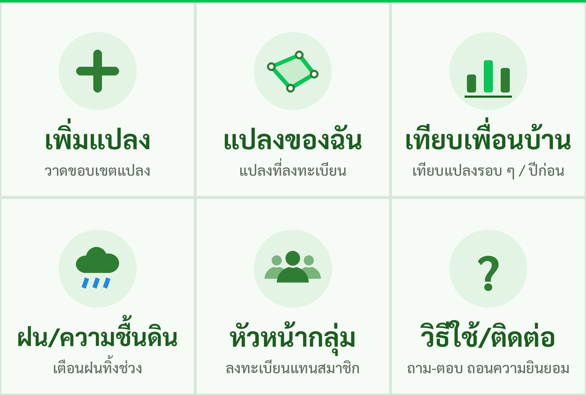

# LINE webhook — บอท "เบิ่งไฮ่" (BerngHai)

LINE OA **@755zfojh** (เบิ่งไฮ่) · Messaging API channel `2011859231` · LINE Login channel
`2011859249` (no LIFF app yet) · plan: Free (300 push/month).

## ทำอะไรได้บ้าง / What it does

| Event | Behaviour |
|---|---|
| `follow` | ตอบข้อความต้อนรับ (reply) อธิบายว่าเบิ่งไฮ่ทำอะไร + "การลงทะเบียนแปลงจะเปิดเร็ว ๆ นี้"; บันทึก `users` (LINE userId, display name จาก profile API, `followed_at`, `is_active=true`) |
| `unfollow` | `users.is_active=false`, `unfollowed_at` (ไม่มี reply token) |
| text | keyword → คำตอบสั้น + quick reply: `เมนู`/`help`/`วิธีใช้`, `แปลงของฉัน`, `เทียบเพื่อนบ้าน`, `ฝน`, `เพิ่มแปลง`, `หัวหน้ากลุ่ม`; อื่น ๆ → fallback |
| postback `action=feedback&alert_id=N&answer=…` | บันทึก `alerts.feedback` (`borer`/`white_leaf`/`weed`/`water_stress`/`no_problem`), `feedback_at`, `feedback_user_id` แล้วตอบขอบคุณ |
| postback `action=rain_report&answer=none\|little\|enough` | ตอบขอบคุณ (ยังไม่เก็บ — ตาราง weather มาใน milestone ฝน) |

* **Reply only.** The webhook never sends push / multicast / broadcast (`canesat.line.client`
  has no such method). Alerts are push messages and belong to the future `notify` job, which must
  enforce the 300/month quota.
* If PostGIS is unreachable the bot still replies; DB writes are skipped and retried after 30 s.
* `canesat.line.messages.build_greenness_alert_flex()` builds the 🔴 alert Flex message from
  mockup 01 (not sent anywhere yet). All reply messages and the Flex alert pass LINE's
  `/v2/bot/message/validate/reply`.
* Migration `0002_line_users.sql` adds `users.followed_at / unfollowed_at / is_active` and
  `alerts.feedback_user_id` (`canesat db migrate`).

## Run

```bash
pip install -e ".[dev]"
canesat db migrate                       # optional, DATABASE_URL
# secrets: a JSON file containing LINE_CHANNEL_SECRET and LINE_CHANNEL_ACCESS_TOKEN (any nesting).
# They are loaded into the server process env only — never put them in the repo or on argv.
python scripts/run_webhook.py --secrets-json /path/to/secrets.json --port 8711
curl localhost:8711/healthz              # {"status":"ok","db":"ok|unavailable|disabled"}
```

Expose it with any HTTPS tunnel, then point LINE at it:

```bash
python scripts/line_webhook_endpoint.py --secrets-json S.json set https://<public>/callback
python scripts/line_webhook_endpoint.py --secrets-json S.json test
python scripts/line_webhook_endpoint.py --secrets-json S.json get   # "active" = Use webhook toggle
```

> ⚠️ The tunnel used during development is **temporary** (quick tunnel / guest relay). Production
> needs a fixed HTTPS domain (design §9: one VM + FastAPI container).

## Rich Menu



`canesat.line.richmenu` — 2500×1686, 3×2 tiles as in mockup 01:
➕ เพิ่มแปลง · 🗺️ แปลงของฉัน · 📊 เทียบเพื่อนบ้าน · 🌧️ ฝน/ความชื้นดิน · 👥 หัวหน้ากลุ่ม · ❓ วิธีใช้/ติดต่อ.
"เพิ่มแปลง" opens `https://liff.line.me/<LIFF_ID>` once `LIFF_ID` is known, otherwise it sends the
keyword; the other tiles send the webhook keywords. The image is drawn with Pillow (Sarabun font,
vector icons) — `docs/richmenu.png`.

```bash
python scripts/create_rich_menu.py                                   # render + print spec
python scripts/create_rich_menu.py --apply --secrets-json S.json     # create + set default
```

Idempotent: after the new menu is the default, older menus named `bernghai-main*` are deleted.
**Re-run it after `LIFF_ID` is set** so the tile switches to the LIFF link.

## LIFF: plot registration (`/liff/register`)

Mobile-first Thai page (mockup 02 + consent from mockup 05), served by the same FastAPI app:

* MapLibre GL + Esri World Imagery (attribution shown), centred on the Khon Kaen pilot; tap to add
  corners, ↶ undo, 🗑️ clear, 📍 locate; live area in rai (1 ไร่ = 1,600 m²) and a
  self-intersection check; registered plots are drawn dashed.
* Fields: plot name, ประเภทอ้อย (อ้อยปลูก / อ้อยตอ / ไม่แน่ใจ), approx. planting / last-harvest
  month, optional "ลงทะเบียนแทนสมาชิก (หัวหน้ากลุ่ม)" with member name + phone.
* PDPA consent per purpose: **service (required)**, leader view, anonymised research; sharing with
  third parties is asked each time. When a leader registers for a member, the leader must confirm
  they read the notice to the owner; consents are stored with `method = assisted_pending` (owner
  confirms later, e.g. SMS OTP).
* `liff.init` → ID token → `POST /api/plots` (`Authorization: Bearer <ID token>`). The backend
  verifies the token at `https://api.line.me/oauth2/v2.1/verify` with
  `client_id = LINE_LOGIN_CHANNEL_ID` (default `2011859249`), validates the polygon (valid, not
  self-intersecting, 0.5–2,000 rai, inside Thailand) and stores it (`plots.source = 'liff'`,
  `registered_by`, `consents` rows). Member phones are stored only as
  `pgp_sym_encrypt(phone, CANESAT_PHONE_KEY)`; without that key they are not stored.
* After saving, the page sends `✅ ลงทะเบียนแปลง "…" (≈ N ไร่) แล้ว` into the chat with
  `liff.sendMessages` (needs the `chat_message.write` scope; a user-sent message, not a push) and
  closes; the webhook answers that text with a short acknowledgement (reply).
* `GET /api/plots` → the user's own plots + plots they registered for members ("แปลงของฉัน" list).
* A new plot is queued for a background NDVI backfill (last ~92 days, `canesat.ingest` +
  `canesat.detect`, one worker thread; disable with `CANESAT_INGEST_ON_REGISTER=0`).

The page reads `LIFF_ID` from server config (injected into the HTML) — set `LIFF_ID` in the
environment / secrets JSON and restart; no code change needed. Without it the page works as a
drawing demo but cannot save.

### LIFF app settings (LINE Developers Console → LINE Login channel 2011859249 → LIFF → Add)

| Setting | Value |
|---|---|
| Size | **Full** |
| Endpoint URL | `https://<stable-https-host>/liff/register` (must return our HTML — see below) |
| Scopes | `openid`, `profile`, **`chat_message.write`** (for the confirmation message) |
| Bot link feature | On (Aggressive) → links the OA @755zfojh |
| Scan QR | off |

### Hosting caveat (dev box)

The LINE *webhook* only needs a relay that forwards POSTs (Hookdeck guest mode works and keeps a
stable URL), but LIFF needs a host that returns **our** HTTP responses. From the dev box,
outbound traffic is limited to TLS on 443: Cloudflare quick/named tunnels (port 7844), localtunnel,
tunnelmole (8083) and plain SSH tunnels fail; Hookdeck answers with its own JSON. Pinggy's free
SSH-over-TLS tunnel works but expires after 60 min with a new random URL and shows a warning page
to browsers — preview only (`/workspace/bernghai-run/start_pinggy.sh`). Production / a stable LIFF
endpoint needs a fixed domain (design §9 VM), or an account-based tunnel with a reserved domain.

## Open items
* Feedback postbacks are not yet restricted to the plot owner / group leader.
* Owner-side consent confirmation (SMS OTP / LINE link) for plots registered by a leader.
* Field photos (image messages) are acknowledged but not stored.
* Notify job (push, quota counter, quiet hours 06:00–19:00), LIFF plot page (F3 graphs), group page.
