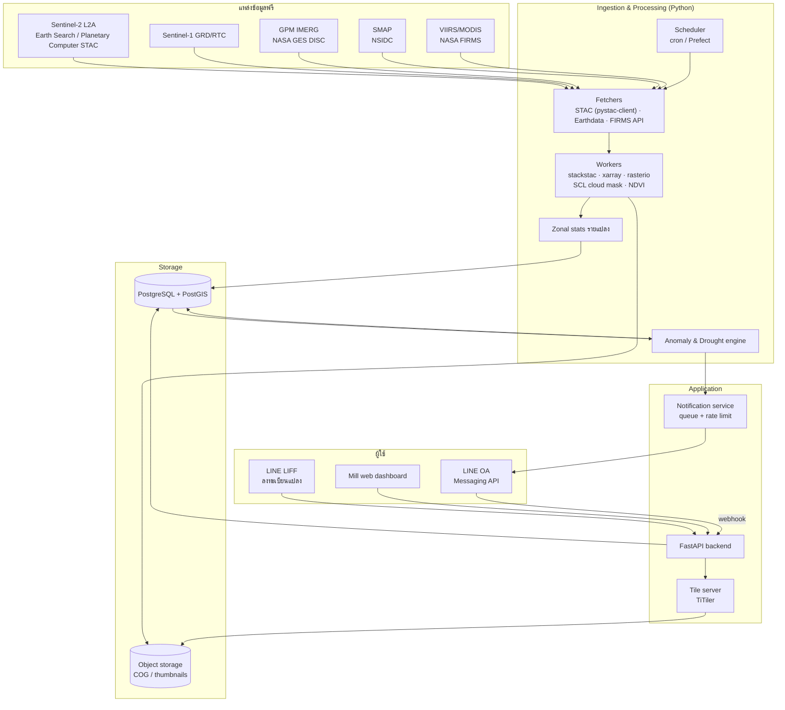
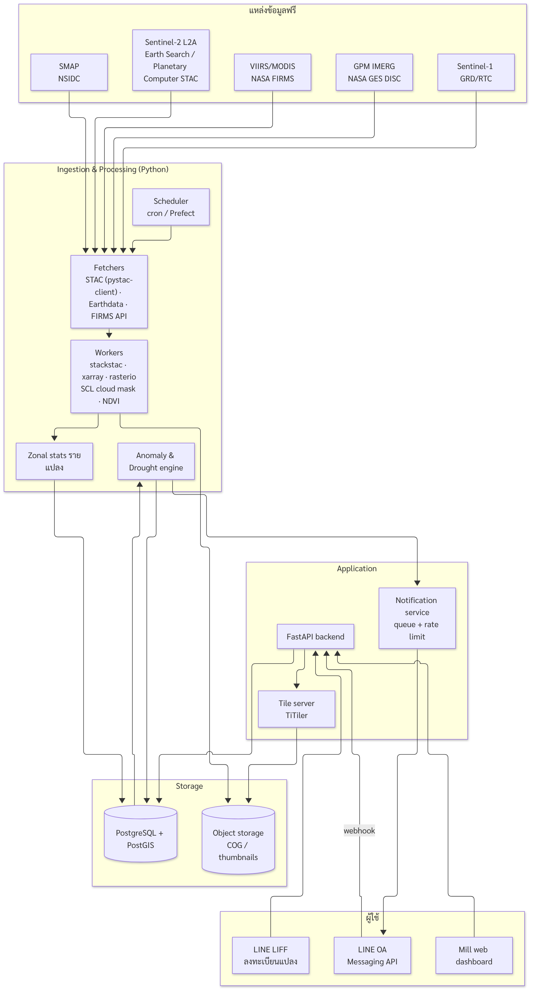

# อ้อยดีด้วยดาวเทียม: เอกสารออกแบบระบบและขอบเขต MVP

**แพลตฟอร์มข้อมูลดาวเทียมสำหรับชาวไร่อ้อยและโรงงานน้ำตาล — โครงการนำร่องจังหวัดขอนแก่น**

| รายการ | รายละเอียด |
|---|---|
| ผู้อ่านหลัก | Sam (GitHub: `rungruang-ops`) — วิศวกรที่กำลังสำรวจไอเดีย |
| สถานะ | ร่างแรก (Draft v0.1) — 4 ต.ค. 2026 |
| ขอบเขต | System design + ขอบเขต MVP 3 เดือน + roadmap เฟส 2–3 |

> หมายเหตุ: ตัวเลขค่าใช้จ่าย/เกณฑ์ (threshold) ในเอกสารนี้เป็น **ค่าประมาณหรือค่าเริ่มต้นสำหรับปรับจูน** เว้นแต่ระบุว่ามาจากแหล่งอ้างอิง เอกสารนี้ไม่อ้างสถิติผลผลิตหรือนโยบายเฉพาะเจาะจงที่ยังไม่ได้ตรวจสอบ

---

## 1. สรุปสำหรับผู้บริหาร (TL;DR)

- **ปัญหา:** ชาวไร่อ้อยในอีสานส่วนใหญ่พึ่งน้ำฝน เจอฝนทิ้งช่วง ตรวจเจอแปลงมีปัญหาช้า ใส่ปุ๋ยไม่ตรงจุด คิวตัดอ้อยไม่สอดคล้องกับความหวาน (CCS) แรงงานตัดขาดแคลนจนต้องเผา น้ำท่วม และเข้าถึงสินเชื่อยาก
- **แนวทาง:** ใช้ข้อมูลดาวเทียม **ฟรี** (Sentinel-2, Sentinel-1, GPM IMERG, SMAP, VIIRS/MODIS FIRMS) ประมวลผลรายแปลงอัตโนมัติ แล้วส่งการแจ้งเตือนผ่าน **LINE OA** ที่ชาวไร่ใช้อยู่แล้ว พร้อมแดชบอร์ดเว็บให้โรงงานน้ำตาล
- **MVP (3 เดือน):** (1) ลงทะเบียนแปลงด้วยการวาด/อัปโหลดขอบเขตผ่าน LINE LIFF (2) แจ้งเตือน NDVI ผิดปกติ (3) แจ้งเตือนภัยแล้ง/ฝนทิ้งช่วง — ฟีเจอร์อื่นอยู่ในเฟส 2–3
- **เทคโนโลยี:** Python (rasterio / xarray / stackstac) + PostgreSQL/PostGIS + object storage เก็บ COG + FastAPI + LINE Messaging API/LIFF + เว็บแดชบอร์ด

---

## 2. เป้าหมายและผู้ใช้

### 2.1 เป้าหมาย

1. ให้ชาวไร่ **รู้ปัญหาเร็วขึ้น** (ภายในไม่กี่วันหลังดาวเทียมผ่าน แทนการรอเดินสำรวจ)
2. ให้ฝ่ายส่งเสริมของโรงงาน **จัดลำดับการลงพื้นที่** ได้จากข้อมูล ไม่ใช่สุ่มหรือรอโทรแจ้ง
3. ให้ฝ่ายวางแผนโรงงานมี **ภาพรวมผลผลิตและความพร้อมเก็บเกี่ยว** ระดับพื้นที่ (เฟส 2+)
4. สร้าง **ประวัติการเจริญเติบโตรายแปลงหลายปี** ที่ใช้เป็นหลักฐานประกอบสินเชื่อ/เงินเกี๊ยว (เฟส 3)

### 2.2 กลุ่มผู้ใช้

| ผู้ใช้ | ความต้องการหลัก | ช่องทาง |
|---|---|---|
| **ชาวไร่อ้อย** (เจ้าของแปลง/ผู้เช่า) | รู้ว่าแปลงไหนผิดปกติ, ฝนจะทิ้งช่วงไหม, ควรทำอะไรต่อ | LINE OA + LIFF (มือถือ) |
| **เจ้าหน้าที่ฝ่ายส่งเสริมของโรงงาน** (นักส่งเสริม / หัวหน้าโควตา) | รายการแปลงที่ควรลงตรวจ เรียงตามความเร่งด่วน, ช่วยชาวไร่ลงทะเบียนแปลง | LINE + เว็บแดชบอร์ด (แท็บเล็ต/โน้ตบุ๊ก) |
| **ฝ่ายวางแผนโรงงาน** (วัตถุดิบ / คิวรับอ้อย) | ภาพรวมพื้นที่ปลูก สุขภาพพืชรายโซน ประมาณการผลผลิต คิวเก็บเกี่ยว | เว็บแดชบอร์ด + export CSV |
| **ผู้ดูแลระบบ** (ทีมเรา) | ตรวจสถานะ pipeline, ปรับ threshold, ดูคุณภาพข้อมูล | Admin UI / Grafana |

### 2.3 ปัญหา → ฟีเจอร์ → แหล่งข้อมูล (ภาพรวมทั้งหมด)

| # | ปัญหา | ฟีเจอร์ | ข้อมูลหลัก | เฟส |
|---|---|---|---|---|
| 1 | ฝนทิ้งช่วง / ภัยแล้ง (อ้อยน้ำฝน) | แจ้งเตือนฝนทิ้งช่วง + ความชื้นดินต่ำ | GPM IMERG, SMAP | **MVP** |
| 2 | เจอแปลงมีปัญหาช้า (หนอนกออ้อย, โรคใบขาว, วัชพืช) | แจ้งเตือน NDVI ผิดปกติ เทียบเพื่อนบ้าน + ปีก่อน | Sentinel-2 L2A | **MVP** |
| 3 | ใส่ปุ๋ยสิ้นเปลือง | แผนที่โซน NDVI ภายในแปลง (variable rate) | Sentinel-2 L2A | เฟส 2 |
| 4 | คิวตัด / ค่าความหวาน CCS | ประเมินความพร้อมเก็บเกี่ยวรายแปลง แชร์กับโรงงาน | Sentinel-2 time series + ข้อมูล CCS จากโรงงาน | เฟส 2 |
| 5 | แรงงานขาด → เผาอ้อย | จองรถตัดแบบกลุ่ม + ตรวจจุดความร้อนยืนยัน "อ้อยสด" | VIIRS/MODIS (FIRMS) | เฟส 2 (ตรวจไฟ) / เฟส 3 (จองรถ) |
| 6 | น้ำท่วม | แผนที่น้ำท่วมด้วย SAR ประกอบการขอความช่วยเหลือ/ประกัน | Sentinel-1 GRD/RTC | เฟส 2 |
| 7 | เข้าถึงสินเชื่อยาก | รายงานประวัติการเติบโตรายแปลงหลายปี (ธ.ก.ส. / เงินเกี๊ยวโรงงาน) | Sentinel-2 archive | เฟส 3 |
| — | โรงงานต้องการประมาณการผลผลิต | ประมาณการผลผลิตรวมรายโซน | ทุกแหล่ง + ข้อมูลรับอ้อยจริง | เฟส 3 |

---

## 3. ขอบเขต MVP

### 3.1 สิ่งที่อยู่ใน MVP

**F1 — ลงทะเบียนแปลง (LINE LIFF)**

- ผู้ใช้เพิ่มเพื่อน LINE OA → กดเมนู "เพิ่มแปลง" → เปิด LIFF app
- วาด polygon บนแผนที่ (ภาพถ่ายดาวเทียมพื้นหลัง) หรือ **อัปโหลดไฟล์** KML/GeoJSON/Shapefile (zip) หรือเดินรอบแปลงด้วย GPS (เฟส 1.5 ถ้ามีเวลา)
- กรอก: ชื่อแปลง, พันธุ์อ้อย (ถ้าทราบ), วันปลูก/ไว้ตอ, ประเภท (อ้อยปลูกใหม่/อ้อยตอ), โรงงานที่ส่ง, เลขโควตา (ไม่บังคับ)
- ตรวจสอบอัตโนมัติ: polygon ถูกต้อง (valid, ไม่ self-intersect), พื้นที่ 0.5–500 ไร่ (ปรับได้), อยู่ในขอบเขตพื้นที่นำร่อง, ซ้อนทับแปลงอื่นเกิน 30% → ให้ยืนยัน
- ฝ่ายส่งเสริมลงทะเบียน **แทน** ชาวไร่ได้ (assisted onboarding) — สำคัญมากสำหรับผู้สูงอายุ
- ขอความยินยอม (consent) ตาม PDPA ก่อนเก็บข้อมูล

**F2 — แจ้งเตือน NDVI ผิดปกติ (LINE OA)**

- ทุกครั้งที่มีภาพ Sentinel-2 ใหม่ (รอบประมาณ 5 วัน) ที่ปลอดเมฆพอ คำนวณค่า NDVI มัธยฐานรายแปลง
- เทียบกับ (ก) แปลงอ้อยข้างเคียงที่อายุใกล้กัน และ (ข) ค่าของแปลงเดียวกันในสัปดาห์เดียวกันของปีก่อน
- ถ้าผิดปกติ → ส่งข้อความ LINE พร้อมภาพแผนที่แปลงและคำแนะนำ "ควรลงไปตรวจ" (ไม่วินิจฉัยโรค)
- ผู้ใช้ตอบกลับได้ว่า "ตรวจแล้ว: พบหนอน / โรคใบขาว / วัชพืช / ขาดน้ำ / ไม่พบปัญหา" → เก็บเป็น **ground truth** สำหรับปรับโมเดล

**F3 — แจ้งเตือนภัยแล้ง / ฝนทิ้งช่วง**

- สะสมฝนรายวันจาก GPM IMERG รายแปลง (ผ่าน grid cell ที่ทับ) และความชื้นดินจาก SMAP
- แจ้งเมื่อฝนทิ้งช่วงนานกว่าที่กำหนด **และ** ความชื้นดินต่ำกว่าค่าปกติของช่วงเวลานั้น
- ส่งแบบรายพื้นที่ (ตำบล/กลุ่มแปลง) เพราะความละเอียดข้อมูลหยาบ (หลายกิโลเมตร)

**F4 — แดชบอร์ดเว็บขั้นต่ำสำหรับฝ่ายส่งเสริม/โรงงาน**

- แผนที่แปลงทั้งหมดที่ลงทะเบียนกับโรงงาน ระบายสีตามสถานะ (ปกติ / เฝ้าระวัง / ผิดปกติ)
- รายการแปลงที่ควรลงตรวจเรียงตามคะแนนความผิดปกติ + ผลการตรวจที่ชาวไร่ตอบกลับ
- กราฟ NDVI time series รายแปลง
- export CSV

### 3.2 สิ่งที่ **ไม่อยู่** ใน MVP (ระบุชัดเจน)

- ❌ แผนที่โซนใส่ปุ๋ยแบบ variable rate (เฟส 2)
- ❌ ประเมินความพร้อมเก็บเกี่ยว / CCS และการแชร์คิวกับโรงงาน (เฟส 2)
- ❌ ตรวจจุดความร้อน (การเผา) และการยืนยันอ้อยสด (เฟส 2)
- ❌ แผนที่น้ำท่วมด้วย Sentinel-1 (เฟส 2 — แต่ใน MVP จะเก็บ Sentinel-1 ไว้ทดลองเป็น fallback ช่วงเมฆมาก แบบภายใน ไม่แจ้งผู้ใช้)
- ❌ ระบบจองรถตัดอ้อยแบบกลุ่ม (เฟส 3)
- ❌ รายงานประวัติแปลงสำหรับสินเชื่อ ธ.ก.ส./เงินเกี๊ยว (เฟส 3)
- ❌ ประมาณการผลผลิต (ตัน/ไร่) ระดับโรงงาน (เฟส 3)
- ❌ การวินิจฉัยชนิดโรค/แมลงจากภาพดาวเทียม (ทำไม่ได้อย่างน่าเชื่อถือด้วยความละเอียด 10 ม. — ระบบบอกแค่ "ผิดปกติ ควรตรวจ")
- ❌ แอปมือถือ native, การชำระเงิน, ภาพความละเอียดสูงเชิงพาณิชย์, โดรน

---

## 4. สถาปัตยกรรมระบบ

### 4.1 แผนภาพสถาปัตยกรรม





### 4.2 Data ingestion (แหล่งข้อมูลฟรี)

| ข้อมูล | ใช้ทำอะไร | ความละเอียด / รอบ (โดยประมาณ) | วิธีเข้าถึง |
|---|---|---|---|
| **Sentinel-2 L2A** | NDVI, cloud mask (SCL) | 10 ม. (B4, B8), 20 ม. (SCL) / ~5 วัน | STAC: Element84 Earth Search (`earth-search.aws.element84.com/v1`, collection `sentinel-2-l2a`, COG บน AWS Open Data) หรือ Microsoft Planetary Computer STAC (ต้อง sign URL ด้วย `planetary-computer` package) |
| **Sentinel-1 GRD / RTC** | ตรวจน้ำท่วม, fallback ช่วงเมฆมาก | ~10–20 ม. / หลายวันต่อครั้ง (ขึ้นกับจำนวนดาวเทียมที่ทำงาน) | Planetary Computer (`sentinel-1-rtc`, `sentinel-1-grd`) หรือ Earth Search |
| **GPM IMERG** | ฝนรายวัน / ฝนทิ้งช่วง | ~0.1° (~10 กม.) / รายครึ่งชั่วโมง–รายวัน; Early Run มีความหน่วงไม่กี่ชั่วโมง | NASA GES DISC (ต้องมีบัญชี NASA Earthdata ฟรี) |
| **SMAP** | ความชื้นดินผิวหน้า | ~9–36 กม. ขึ้นกับผลิตภัณฑ์ / 2–3 วัน | NASA NSIDC DAAC (Earthdata) — ใช้ L3 หรือ L4 (L4 มีข้อมูลรายวันแบบ model-assimilated) |
| **VIIRS / MODIS (FIRMS)** | จุดความร้อน (เฟส 2) | 375 ม. (VIIRS), 1 กม. (MODIS) / หลายครั้งต่อวัน | NASA FIRMS API (ต้องขอ MAP_KEY ฟรี) |

หลักการ:

- **ไม่ดาวน์โหลดทั้ง scene** — อ่านเฉพาะ window ของ bbox พื้นที่นำร่องจาก COG (HTTP range request) ผ่าน `stackstac`/`odc-stac`
- ทำงานใน **cloud region ใกล้ข้อมูล** ถ้าเป็นไปได้ (เช่น AWS `us-west-2` สำหรับ Earth Search) เพื่อลดเวลาอ่าน — แต่ข้อมูลฟรีทั้งสองที่อ่านจากที่ไหนก็ได้
- ทุก job เป็น **idempotent** อ้างอิงด้วย `(source, item_id)` รันซ้ำได้ไม่เกิดข้อมูลซ้ำ

### 4.3 Processing pipeline

Scheduler (เริ่มด้วย cron + Python script ใน container, ขยายเป็น Prefect/Dagster เมื่อจำเป็น):

| Job | ความถี่ | งาน |
|---|---|---|
| `s2_discover` | ทุก 6 ชม. | ค้น STAC หา item ใหม่ที่ทับ AOI ขอนแก่น, `eo:cloud_cover < 80` (กรองหยาบ) → ใส่คิว |
| `s2_process` | ตามคิว | โหลด B04, B08, SCL → mask เมฆ → NDVI → เขียน COG ของ AOI ลง object storage → zonal stats รายแปลง → `plot_observation` |
| `anomaly_run` | หลัง `s2_process` เสร็จ | คำนวณ z-score เทียบเพื่อนบ้าน + ปีก่อน → `alert` |
| `rain_ingest` | รายวัน | ดึง IMERG รายวัน → สะสมฝนรายแปลง/ตำบล → `weather_daily` |
| `smap_ingest` | รายวัน | ดึง SMAP → ค่าความชื้นดิน + anomaly เทียบ climatology → `weather_daily` |
| `drought_run` | รายวัน | ตรวจเงื่อนไขฝนทิ้งช่วง → `alert` |
| `notify_dispatch` | ทุก 15 นาที (06:00–19:00) | ส่ง alert ที่รอส่งผ่าน LINE ตามกฎ rate limit / quiet hours |
| `backfill` | ครั้งเดียวตอนลงทะเบียนแปลง | ดึงประวัติ Sentinel-2 ย้อนหลัง 3–5 ปีสำหรับแปลงใหม่ (สร้าง baseline) |

ไลบรารีหลัก: `pystac-client`, `stackstac` หรือ `odc-stac`, `xarray`, `rioxarray`, `rasterio`, `dask` (ถ้าข้อมูลใหญ่), `exactextract` หรือ `rasterstats` (zonal stats), `shapely`, `geopandas`, `pyproj`

### 4.4 Storage

- **PostgreSQL 16 + PostGIS**: ข้อมูลผู้ใช้, แปลง (geometry), ค่าสถิติรายแปลงต่อวัน (time series), alerts, feedback
  - ตาราง `plot_observation` จะโตเร็ว → partition ตามปี หรือใช้ TimescaleDB (ไม่บังคับ)
  - Geometry เก็บเป็น `geometry(MultiPolygon, 4326)` + คอลัมน์ที่ project เป็น UTM 48N (EPSG:32648) สำหรับคำนวณพื้นที่
- **Object storage** (S3 / Cloudflare R2 / MinIO): NDVI COG ของ AOI ต่อวันที่, thumbnail PNG รายแปลงสำหรับแนบในข้อความ LINE
  - lifecycle: เก็บ COG ระดับ AOI ไว้ตลอด (ใช้ทำ baseline), ลบ thumbnail เก่ากว่า 1 ปี

### 4.5 API backend

- **FastAPI** (Python — ใช้ภาษาเดียวกับ pipeline, แชร์โค้ด geospatial ได้)
- Endpoint หลัก:
  - `POST /line/webhook` — รับ event จาก LINE (follow, message, postback) ตรวจ `X-Line-Signature`
  - `POST /plots`, `GET /plots/{id}`, `PATCH /plots/{id}` — ลงทะเบียน/แก้ไขแปลง (auth ด้วย LIFF ID token ที่ verify กับ LINE)
  - `POST /plots/upload` — รับ KML/GeoJSON/Shapefile zip
  - `GET /plots/{id}/timeseries` — NDVI รายแปลง
  - `GET /mill/{mill_id}/plots?status=anomaly` — สำหรับแดชบอร์ด
  - `POST /alerts/{id}/feedback` — ผลการลงตรวจ
- **TiTiler** เสิร์ฟ tile จาก COG ใน object storage ให้แผนที่บนแดชบอร์ด/LIFF
- Auth แดชบอร์ด: email + password/OAuth ผ่านบริการสำเร็จรูป (เช่น Keycloak, Supabase Auth) พร้อม role (`extension`, `planner`, `admin`) และจำกัดข้อมูลตาม `mill_id`

### 4.6 LINE Messaging API + LIFF frontend

- **LINE OA** เป็นช่องทางหลักของชาวไร่ — ไม่ต้องติดตั้งแอปใหม่
- **Rich menu**: `เพิ่มแปลง` · `แปลงของฉัน` · `สภาพอากาศ` · `ติดต่อฝ่ายส่งเสริม`
- **LIFF app** (React/Vite หรือ Svelte + MapLibre GL JS): หน้าวาดแปลง, ดูแปลงของฉัน, ดูกราฟ NDVI แบบง่าย
- ข้อความแจ้งเตือนใช้ **Flex Message** (การ์ดมีรูป + ปุ่ม) และ **postback** สำหรับปุ่มตอบกลับผลการตรวจ
- ข้อควรรู้เรื่องโควตา: push message นับโควตารายเดือนของ OA ส่วนการ "ตอบกลับ" (reply) ข้อความที่ผู้ใช้ส่งมาไม่นับ → ออกแบบให้ข้อมูลที่ไม่เร่งด่วน (เช่น สรุปรายสัปดาห์) เป็นแบบ "ผู้ใช้กดถาม แล้วระบบตอบ"

### 4.7 Mill web dashboard

- React + MapLibre GL JS (หรือเริ่มเร็วด้วย Streamlit/Dash สำหรับ 2–3 เดือนแรก แล้วค่อยย้าย)
- หน้าหลัก: แผนที่แปลง + ตัวกรอง (สถานะ, นักส่งเสริม, ตำบล, อายุอ้อย) → รายการ "ควรลงตรวจ" → หน้ารายละเอียดแปลง (time series, ภาพ NDVI ล่าสุด, ประวัติ alert/feedback)

---

## 5. Data model (ตารางหลัก)

```sql
-- ผู้ใช้และองค์กร
mill            (id, name, province, created_at)
app_user        (id, line_user_id UNIQUE, display_name, phone_enc, role,  -- farmer|extension|planner|admin
                 mill_id FK NULL, consent_version, consent_at, created_at, deleted_at)
farmer_profile  (user_id PK FK, quota_no_enc NULL, extension_officer_id FK NULL, village, tambon_code)

-- แปลง
plot            (id, owner_user_id FK, mill_id FK NULL, name,
                 geom geometry(MultiPolygon,4326), geom_utm geometry(MultiPolygon,32648),
                 area_rai NUMERIC, tambon_code, status,         -- active|archived
                 registered_by FK, created_at, updated_at)
plot_season     (id, plot_id FK, crop_year, cane_type,          -- plant|ratoon
                 variety NULL, planting_date NULL, ratoon_no NULL,
                 harvest_date NULL, harvest_type NULL)          -- fresh|burnt (เฟส 2)

-- ข้อมูลดาวเทียม
scene           (id, source, item_id UNIQUE, acquired_at, cloud_cover, processed_at, cog_uri)
plot_observation(plot_id FK, scene_id FK, acquired_at, valid_pixel_ratio,
                 ndvi_median, ndvi_p10, ndvi_p90, n_pixels,
                 PRIMARY KEY (plot_id, scene_id))               -- partition by year
weather_daily   (grid_or_tambon_id, date, rain_mm, rain_7d, rain_30d,
                 sm_surface, sm_anomaly, source)

-- แจ้งเตือน
alert           (id, plot_id FK NULL, area_code NULL, type,     -- ndvi_anomaly|drought|...
                 severity, score JSONB, observed_at, created_at,
                 status)                                        -- pending|sent|suppressed|resolved
alert_delivery  (id, alert_id FK, user_id FK, channel, line_request_id, sent_at, read_hint)
alert_feedback  (id, alert_id FK, user_id FK, outcome,          -- borer|white_leaf|weed|water|none|other
                 note, photo_uri NULL, created_at)

-- การตั้งค่า
threshold_config(id, key, value JSONB, scope, valid_from)       -- ปรับ threshold ได้โดยไม่ deploy
audit_log       (id, actor_id, action, entity, entity_id, at)   -- PDPA: ใครเข้าถึงข้อมูลอะไร
```

ดัชนีสำคัญ: `GIST(plot.geom)`, `GIST(plot.geom_utm)`, `(plot_id, acquired_at)` บน `plot_observation`

---

## 6. ตรรกะตรวจจับความผิดปกติ (NDVI anomaly) แบบเป็นรูปธรรม

### 6.1 ขั้นตอนต่อภาพ Sentinel-2 หนึ่งภาพ

1. **โหลด** B04 (Red), B08 (NIR) ที่ 10 ม. และ SCL ที่ 20 ม. (resample แบบ nearest เป็น 10 ม.) เฉพาะ AOI
2. **Cloud mask ด้วย SCL** — เก็บเฉพาะ class: `4` (vegetation), `5` (not vegetated), `6` (water), `7` (unclassified — ไม่บังคับ, ปรับได้). ตัดทิ้ง: `0` no data, `1` saturated/defective, `2` dark area, `3` cloud shadow, `8` cloud medium prob., `9` cloud high prob., `10` thin cirrus, `11` snow
   - ขยาย (dilate) mask เมฆ/เงาเมฆออก 1–2 พิกเซล เพื่อกันขอบเมฆที่ SCL พลาด
   - หมายเหตุ: ข้อมูลตั้งแต่ processing baseline 04.00 (ต้นปี 2022) มี offset ของค่าสะท้อน (BOA_ADD_OFFSET) — ต้องจัดการให้สม่ำเสมอเมื่อเทียบข้ามปี (ต้องตรวจ metadata/เอกสารของ collection ที่ใช้ว่าปรับ offset ให้แล้วหรือยัง)
3. **NDVI** = (B08 − B04) / (B08 + B04)
4. **Zonal stats รายแปลง**: ใช้ **inner buffer −10 ม.** (หดขอบแปลงเข้า 1 พิกเซล) เพื่อลดพิกเซลปน (mixed pixel) กับถนน/คันนา/แปลงข้างเคียง — ถ้าแปลงเล็กจนหดแล้วเหลือ < 4 พิกเซล ให้ใช้ polygon เดิมแบบ fractional coverage (`exactextract`) และติดธง `small_plot`
5. **เกณฑ์ข้อมูลใช้ได้**: `valid_pixel_ratio ≥ 0.6` และ `n_valid_pixels ≥ 4` ไม่งั้นข้ามภาพนั้นสำหรับแปลงนั้น
6. บันทึก `ndvi_median` (ใช้มัธยฐานเพราะทนต่อค่าผิดปกติ), `p10`, `p90`

### 6.2 การเทียบ 2 แบบ

**(ก) เทียบเพื่อนบ้าน (spatial z-score)** — ตรวจปัญหาเฉพาะแปลง

- กลุ่มเพื่อนบ้าน = แปลงอ้อยที่ลงทะเบียนในรัศมี **R = 5 กม.** (ปรับได้), อายุอ้อยต่างกันไม่เกิน **±45 วัน**, ประเภทเดียวกัน (อ้อยปลูก/อ้อยตอ), มีข้อมูลจาก **ภาพเดียวกัน**
- ต้องมีเพื่อนบ้าน **≥ 8 แปลง** ถ้าไม่ถึงให้ขยายรัศมีเป็น 10 กม. ถ้ายังไม่ถึง → ไม่ใช้วิธีนี้
- ใช้สถิติที่ทนค่าผิดปกติ: `z_nb = (x − median_nb) / (1.4826 × MAD_nb)`
- ช่วงแรกที่ผู้ใช้ยังน้อย: เสริมกลุ่มเพื่อนบ้านด้วย **"พิกเซลอ้อยไม่ลงทะเบียน"** จากแผนที่พืชพรรณ (เช่น ESA WorldCover ชั้น cropland หรือแผนที่อ้อยที่ทีมทำเอง) — เป็นตัวเลือกเฟส 1.5

**(ข) เทียบปีก่อนช่วงเดียวกัน (temporal z-score)** — ตรวจว่าแปลงนี้แย่กว่าปกติของตัวเอง

- baseline = NDVI ของแปลงเดียวกันในหน้าต่าง **±10 วัน ของวันเดียวกันของปี** ใน 3–5 ปีก่อน (จาก backfill)
- ควรเทียบตาม **อายุอ้อย** (วันหลังปลูก/ตัด) ด้วยถ้าทราบวันปลูก เพราะวันปลูกแต่ละปีไม่ตรงกัน
- `z_hist = (x − mean_hist) / max(std_hist, 0.05)` (กำหนด std ขั้นต่ำกัน baseline ที่แกว่งน้อยเกินไป)
- ต้องมี ≥ 2 ปีที่มีข้อมูล ไม่งั้นใช้แค่ (ก)

**(ค) การลดลงฉับพลัน (drop)** — เสริม

- Δ = x − ค่าเฉลี่ยเคลื่อนที่ของ 2–3 ภาพก่อนหน้า (ที่ใช้ได้) ถ้าลดลง > 0.15 ภายใน ≤ 20 วัน ในช่วงที่อ้อยควรโตอยู่ → ผิดปกติ (แต่ต้องตัดกรณีเก็บเกี่ยวออก)

### 6.3 กฎตัดสินและความรุนแรง (ค่าเริ่มต้น — ปรับได้ใน `threshold_config`)

| ระดับ | เงื่อนไข |
|---|---|
| 🔴 **ผิดปกติ (ควรตรวจ)** | `z_nb ≤ −2.0` **และ** (`z_hist ≤ −1.5` หรือไม่มี hist) **ติดต่อกัน 2 ภาพที่ใช้ได้** หรือ `Δ ≤ −0.15` + `z_nb ≤ −1.5` |
| 🟡 **เฝ้าระวัง** | `z_nb ≤ −1.5` หรือ `z_hist ≤ −1.5` ครั้งเดียว (แสดงในแดชบอร์ด ไม่ส่ง LINE) |
| 🟢 ปกติ | นอกเหนือจากนี้ |

ข้อยกเว้น / กันแจ้งเตือนผิด:

- **ไม่แจ้ง** ในช่วงอายุอ้อย < 60 วัน (ทรงพุ่มยังไม่ปิด NDVI ต่ำโดยธรรมชาติ) และช่วงหลังวันเก็บเกี่ยว/ช่วงเก็บเกี่ยวของโรงงาน ถ้า NDVI ลดลงแบบฉับพลันทั้งแปลง → ถามผู้ใช้ "ตัดแล้วหรือยัง?" แทนการแจ้งผิดปกติ
- **Cooldown**: แปลงเดียวกันประเภทเดียวกัน แจ้งไม่เกิน 1 ครั้ง/14 วัน เว้นแต่ระดับแย่ลง
- ถ้า **> 40% ของแปลงในพื้นที่** ผิดปกติพร้อมกัน → น่าจะเป็นเหตุระดับพื้นที่ (แล้ง/ปัญหาข้อมูล) → ระงับ alert รายแปลง แล้วส่งให้ทีมตรวจ + พิจารณาเป็น drought alert
- **การปรับจูน**: ใช้ `alert_feedback` คำนวณ precision (สัดส่วน alert ที่ลงไปแล้วพบปัญหาจริง) รายเดือน แล้วปรับ threshold — ตั้งเป้าไม่ให้ชาวไร่ได้ alert จนเบื่อ

### 6.4 ตรรกะแจ้งเตือนภัยแล้ง (F3)

ค่าเริ่มต้น (ต้องปรับให้เหมาะกับอ้อยและพื้นที่ร่วมกับนักวิชาการ/ฝ่ายส่งเสริม):

- **ฝนทิ้งช่วง**: จำนวนวันติดต่อกันที่ฝนรายวัน < 1 มม. ≥ **15 วัน** ในช่วงฤดูฝน (พ.ค.–ต.ค.) หรือ ฝนสะสม 30 วัน < **40% ของค่าเฉลี่ยระยะยาว** (climatology จาก IMERG ย้อนหลัง ≥ 10 ปี) ของช่วงเดียวกัน
- **ความชื้นดิน**: SMAP surface soil moisture anomaly ต่ำกว่า percentile ที่ **20** ของช่วงเวลาเดียวกัน
- ระดับ 🟠 เตือน = เข้าเงื่อนไขอย่างใดอย่างหนึ่ง (แสดงแดชบอร์ด) / 🔴 แจ้ง LINE = เข้าทั้งสองเงื่อนไข และอ้อยอยู่ในช่วงอายุที่อ่อนไหว (เช่น ช่วงตั้งตัว–แตกกอ)
- **ส่งต่อพื้นที่** (ตำบล) ไม่ใช่ต่อแปลง เพราะ IMERG ~10 กม. และ SMAP ~9–36 กม. — บอกผู้ใช้ชัดว่าเป็น "ภาพรวมพื้นที่"
- (ทางเลือก) เสริม NDMI/NDWI จาก Sentinel-2 ระดับแปลงเป็นตัวยืนยันความเครียดน้ำ

---

## 7. การออกแบบการแจ้งเตือน (LINE)

หลักการ:

- **ภาษาง่าย ไม่ใช้ศัพท์เทคนิค** (ไม่พูดว่า "NDVI" หรือ "z-score" กับชาวไร่ — ใช้ "ความเขียวของอ้อย")
- **บอกสิ่งที่ควรทำ** และ **บอกว่าไม่แน่นอน** (ดาวเทียมบอกได้แค่ว่า "ผิดปกติ" ไม่รู้สาเหตุแน่ชัด)
- ส่งช่วง **06:00–19:00** เท่านั้น, จำกัด ≤ 2 ข้อความ/ผู้ใช้/สัปดาห์ (ยกเว้นเหตุรุนแรง)
- แจ้ง **นักส่งเสริมที่ดูแล** คู่ขนาน (ถ้าชาวไร่ยินยอม)
- มีปุ่มตอบกลับเสมอ → ได้ feedback กลับมาปรับระบบ

### 7.1 ตัวอย่าง: แจ้งเตือนแปลงผิดปกติ (Flex Message)

> 🔴 **แปลง "ไร่หลังบ้าน" (12 ไร่) ควรลงไปดู**
>
> ภาพดาวเทียมวันที่ 28 ก.ย. พบว่าอ้อยในแปลงนี้ **เขียวน้อยกว่าแปลงข้างเคียง** และน้อยกว่าช่วงเดียวกันของปีที่แล้ว โดยเฉพาะ **ด้านทิศเหนือของแปลง** (ดูพื้นที่สีแดงในภาพ)
>
> อาจเกิดจาก: หนอนกออ้อย, โรคใบขาว, วัชพืช หรือขาดน้ำ — ดาวเทียมบอกสาเหตุไม่ได้ แนะนำให้ลงไปตรวจภายใน 3–5 วัน
>
> [ภาพแผนที่แปลง]
>
> **ลงไปดูแล้วเจออะไร?**
> [ หนอนกอ ] [ ใบขาว ] [ วัชพืช ] [ ขาดน้ำ ] [ ไม่พบปัญหา ] [ อื่น ๆ ]
>
> [ 📞 ปรึกษานักส่งเสริม ] [ 📈 ดูกราฟความเขียว ]

### 7.2 ตัวอย่าง: แจ้งเตือนฝนทิ้งช่วง

> 🟠 **เตือนฝนทิ้งช่วง — ต.บ้านแฮด และพื้นที่ใกล้เคียง**
>
> ฝนไม่ตกเกิน 1 มม. มาแล้ว **16 วัน** และความชื้นในดินต่ำกว่าปกติของช่วงนี้ แปลงของคุณ 2 แปลง (ไร่หลังบ้าน, ไร่โนนสูง) อยู่ในพื้นที่นี้
>
> ข้อแนะนำทั่วไป: ถ้ามีแหล่งน้ำ พิจารณาให้น้ำเสริมแปลงอ้อยอายุน้อย, เลื่อนการใส่ปุ๋ยเคมีจนกว่าดินจะมีความชื้น, คลุมดินด้วยใบอ้อยเพื่อลดการระเหย
>
> ℹ️ ข้อมูลนี้เป็นภาพรวมของพื้นที่ (ข้อมูลฝนจากดาวเทียมละเอียดราว 10 กม.) อาจต่างจากฝนที่ตกจริงในแปลง
>
> **ฝนที่แปลงคุณตกบ้างไหม?** [ ไม่ตกเลย ] [ ตกเล็กน้อย ] [ ตกพอ ]

(หมายเหตุ: ชื่อตำบลในตัวอย่างใช้เพื่อประกอบเท่านั้น ข้อความคำแนะนำทางการเกษตรต้องให้นักวิชาการ/ฝ่ายส่งเสริมของโรงงานตรวจทานก่อนใช้จริง)

### 7.3 ตัวอย่าง: ยืนยันการลงทะเบียนแปลง

> ✅ ลงทะเบียนแปลง **"ไร่โนนสูง"** สำเร็จ — พื้นที่ประมาณ **8.4 ไร่**
> ระบบกำลังดึงภาพดาวเทียมย้อนหลังของแปลงนี้ จะเริ่มแจ้งเตือนได้ภายใน 1–2 วัน
> [ ดูแปลงของฉัน ] [ แก้ไขขอบเขต ]

---

## 8. Tech stack ที่แนะนำ

| ชั้น | เลือก | เหตุผล |
|---|---|---|
| ภาษา | **Python 3.12** (pipeline + API), **TypeScript** (LIFF + dashboard) | ระบบนิเวศ geospatial ของ Python ครบที่สุด |
| Geospatial | pystac-client, stackstac/odc-stac, xarray, rioxarray, rasterio, exactextract, geopandas, shapely | มาตรฐานงาน EO แบบ cloud-native |
| Orchestration | cron (MVP) → **Prefect** หรือ Dagster | เริ่มง่าย ขยายได้ มี retry/observability |
| DB | **PostgreSQL 16 + PostGIS 3** (managed หรือ self-host) | spatial query, ทีมคุ้นเคย |
| Object storage | **Cloudflare R2** หรือ AWS S3 / MinIO | เก็บ COG/PNG; R2 ไม่คิดค่า egress |
| API | **FastAPI** + Uvicorn, SQLAlchemy/GeoAlchemy2 | async, OpenAPI อัตโนมัติ |
| Tile | **TiTiler** | เสิร์ฟ COG เป็น tile ได้ทันที |
| Frontend | React + Vite + **MapLibre GL JS**, LIFF SDK | ฟรี โอเพนซอร์ส ไม่ผูก Mapbox token |
| Messaging | **LINE Messaging API** (Flex Message, Rich menu, postback) | ชาวไร่ใช้ LINE อยู่แล้ว |
| Infra | Docker Compose บน VM 1 เครื่อง (MVP) → container service เมื่อโต | ลดความซับซ้อนช่วงนำร่อง |
| Monitoring | Sentry (errors), Uptime check, log แบบ structured | free tier ใช้ได้ช่วงนำร่อง |
| CI/CD | GitHub Actions | repo อยู่ใน GitHub อยู่แล้ว |

### 8.1 ค่าใช้จ่ายโดยประมาณ (ช่วงนำร่อง ~500–2,000 แปลง)

| รายการ | ค่าใช้จ่าย | ที่มา / ความมั่นใจ |
|---|---|---|
| ข้อมูลดาวเทียม (Sentinel-1/2, IMERG, SMAP, FIRMS) | **ฟรี** | เป็นข้อมูลเปิด; NASA ต้องมีบัญชี Earthdata ฟรี, FIRMS ต้องขอ MAP_KEY ฟรี |
| LINE OA — แพ็กเกจ Free | **0 บาท/เดือน, 300 ข้อความ/เดือน** | ราคาประเทศไทยตามที่ LINE ประกาศ (ตรวจ ณ ก.ย.–ต.ค. 2026) — การตอบกลับ (reply) แชทไม่นับโควตา |
| LINE OA — Basic / Pro | **1,280 / 1,780 บาท/เดือน** (15,000 / 35,000 ข้อความ, ไม่รวม VAT 7%) | ราคาไทยตามที่ LINE ประกาศ — ข้อความ push นับต่อผู้รับ 1 คน |
| VM สำหรับ pipeline + API + DB (เช่น 4 vCPU / 16 GB) | **ประมาณการ: หลักพันบาทต่อเดือน** | ขึ้นกับผู้ให้บริการ — ต้องเช็คราคาจริงก่อนตัดสินใจ |
| Object storage (COG ของ AOI ขอนแก่น) | **ประมาณการ: ต่ำ** (ระดับสิบถึงร้อย GB ในปีแรก) | ขึ้นกับว่าเก็บ COG ทั้ง AOI หรือแค่ clip รายแปลง |
| โดเมน + SSL | Let's Encrypt ฟรี + ค่าโดเมนรายปี | — |

ประมาณการจำนวนข้อความ LINE: ถ้ามี 1,000 ผู้ใช้ × ~6 push/เดือน ≈ 6,000 ข้อความ → เกิน Free (300) → ต้องใช้ Basic ช่วงนำร่องจริง (ช่วง prototype ใช้ Free ได้)

---

## 9. ความเสี่ยงและแนวทางรับมือ

| ความเสี่ยง | ผลกระทบ | แนวทางรับมือ |
|---|---|---|
| **เมฆมากในฤดูฝน** (ราว พ.ค.–ต.ค.) ทำให้ Sentinel-2 ใช้ไม่ได้หลายสัปดาห์ | alert ช้า/ขาดช่วง ตรงกับช่วงที่อ้อยโตและเสี่ยงที่สุด | ใช้ทุกภาพที่ปลอดเมฆ *บางส่วน* (mask ระดับพิกเซล ไม่ใช่ทั้งภาพ); เฟส 2 ใช้ **Sentinel-1 SAR** (VH backscatter, VH/VV ratio) เป็นตัวชี้วัด fallback ที่ทะลุเมฆได้; แสดงให้ผู้ใช้เห็นว่า "ไม่มีภาพชัดตั้งแต่วันที่…" แทนการเงียบ |
| **แปลงเล็ก vs พิกเซล 10 ม.** (1 ไร่ = 1,600 ม² ≈ 16 พิกเซล) | ค่ารายแปลงปนกับขอบ/แปลงข้าง → false alert | inner buffer, เกณฑ์จำนวนพิกเซลขั้นต่ำ, ธง `small_plot` ใช้ threshold เข้มขึ้น, รวมแปลงติดกันของเจ้าของเดียว, สื่อสารว่าแปลงเล็กมากแม่นยำน้อยกว่า |
| **ขอบเขตแปลงที่วาดผิด** | ข้อมูลผิดทั้งระบบ | แสดงภาพ Sentinel-2/ภาพความละเอียดสูงพื้นหลังตอนวาด, ให้นักส่งเสริมตรวจยืนยัน, ตรวจซ้อนทับ, ตรวจว่า NDVI time series ดูเป็นอ้อย |
| **การยอมรับของชาวไร่ / ทักษะดิจิทัล** (ผู้สูงอายุ) | ลงทะเบียนน้อย, ไม่อ่าน alert | ใช้ LINE ที่คุ้นเคย; ให้ **นักส่งเสริมลงทะเบียนแทน**; ให้ลูกหลานเป็นผู้ดูแลบัญชีร่วม; ข้อความสั้น มีภาพ; ทดสอบกับผู้ใช้จริงก่อนปล่อย; ทำ onboarding ผ่านการประชุมกลุ่มชาวไร่ของโรงงาน |
| **Alert ผิดบ่อย (alert fatigue)** | ผู้ใช้เลิกเชื่อ / block OA | เริ่มด้วย threshold เข้ม, cooldown, ส่งเฉพาะระดับแดง, วัด precision จาก feedback |
| **PDPA (พ.ร.บ.คุ้มครองข้อมูลส่วนบุคคล พ.ศ. 2562)** | ข้อมูลตำแหน่งแปลง + ตัวตนชาวไร่ + เลขโควตา = ข้อมูลส่วนบุคคล | ขอ consent ที่ชัดเจนแยกวัตถุประสงค์ (แจ้งเตือน / แชร์กับโรงงาน / แชร์กับสถาบันการเงินในอนาคต); privacy notice ภาษาไทย; เก็บเท่าที่จำเป็น; เข้ารหัสฟิลด์อ่อนไหว; RBAC ตาม `mill_id`; audit log; ช่องทางขอลบ/ถอนความยินยอม; ทำ data processing agreement กับโรงงาน; ปรึกษานักกฎหมายก่อนเปิดใช้จริง |
| **ความสัมพันธ์ชาวไร่–โรงงาน** | ชาวไร่กังวลว่าข้อมูลจะถูกใช้กดราคา/ตัดโควตา | ชาวไร่เป็นเจ้าของข้อมูล เลือกได้ว่าจะแชร์อะไรกับโรงงาน; โรงงานเห็นข้อมูลรวม (aggregate) โดย default |
| **ความต่อเนื่องของแหล่งข้อมูล** (API/STAC เปลี่ยน, ดาวเทียมเสีย) | pipeline หยุด | abstraction ชั้น data source รองรับทั้ง Earth Search และ Planetary Computer; monitoring "ไม่มีภาพใหม่เกิน X วัน" |
| **ข้อมูลความละเอียดหยาบสำหรับภัยแล้ง** | เตือนผิดระดับแปลง | สื่อสารว่าเป็นระดับพื้นที่; ใช้ feedback "ฝนตกที่แปลงไหม" ปรับ |

---

## 10. ตัวชี้วัดความสำเร็จของการนำร่อง

ตั้งเป้าเบื้องต้น (ต้องตกลงร่วมกับโรงงานคู่ค้า — ตัวเลขด้านล่างเป็น **เป้าตั้งต้น ไม่ใช่การคาดการณ์**):

**การใช้งาน (Adoption)**

- จำนวนชาวไร่ที่ลงทะเบียน ≥ 1 แปลง: เป้า 200–500 ราย ใน 3 เดือนแรกของการนำร่อง
- พื้นที่แปลงที่ลงทะเบียนรวม (ไร่) และสัดส่วนต่อพื้นที่ส่งอ้อยของโรงงานคู่ค้า
- อัตราการ block LINE OA < 10%
- สัดส่วนการลงทะเบียนที่ทำเอง vs. ที่นักส่งเสริมช่วย (บอกระดับ digital literacy)

**คุณภาพ (Quality)**

- **Precision ของ alert NDVI** (alert ที่ลงไปตรวจแล้วพบปัญหาจริง / alert ที่ได้ feedback) — เป้าตั้งต้น ≥ 50%
- อัตราการตอบ feedback ต่อ alert ≥ 30%
- Latency: เวลาจากดาวเทียมถ่ายภาพ → ส่ง alert (median) ≤ 48 ชม.
- สัดส่วนแปลงที่มีข้อมูลใช้ได้อย่างน้อย 1 ครั้งใน 30 วัน (วัดผลกระทบของเมฆ)

**คุณค่า (Value)**

- นักส่งเสริมรายงานว่าใช้รายการ "ควรลงตรวจ" วางแผนลงพื้นที่ (สัมภาษณ์/แบบสอบถาม)
- กรณีตัวอย่างที่ alert ช่วยให้พบปัญหาเร็วขึ้น (เก็บเป็น case study พร้อมภาพ)
- ความพึงพอใจของชาวไร่ (แบบสอบถามสั้นใน LINE, NPS)
- โรงงานต้องการขยายต่อ / ร่วมลงทุนเฟส 2 หรือไม่

**ระบบ (Ops)**

- pipeline สำเร็จ ≥ 95% ของ scene ที่ควรประมวลผล
- uptime API ≥ 99% ช่วงกลางวัน

---

## 11. แผนงานตามระยะ (Timeline)

### 11.1 MVP — 3 เดือน (12 สัปดาห์)

| สัปดาห์ | งาน | ผลลัพธ์ |
|---|---|---|
| **1–2** | คุยกับโรงงานคู่ค้า + ฝ่ายส่งเสริม + ชาวไร่ 5–10 ราย; เลือก AOI (อำเภอนำร่องในขอนแก่น); ตั้ง repo, CI, infra (Docker Compose, PostGIS, object storage); สมัคร LINE OA, LIFF, Earthdata, FIRMS key | requirement ที่ยืนยันแล้ว, infra พร้อม |
| **3–4** | Pipeline Sentinel-2: STAC search → SCL mask → NDVI → zonal stats; backfill ย้อนหลัง 3–5 ปี สำหรับแปลงตัวอย่าง (ขอขอบเขตแปลงจากโรงงาน หรือวาดเอง 50–100 แปลง) | NDVI time series รายแปลงใน DB |
| **5–6** | LIFF ลงทะเบียนแปลง (วาด + อัปโหลด), LINE webhook, consent PDPA, rich menu; API หลัก | ชาวไร่ทดสอบลงทะเบียนได้ |
| **7–8** | Anomaly engine (z_nb, z_hist, drop) + threshold_config; ตรวจย้อนหลังกับฤดูก่อน (ดูว่า alert ที่ระบบจะยิงย้อนหลังดูสมเหตุสมผลไหม ร่วมกับนักส่งเสริม); pipeline IMERG + SMAP + drought rule | alert engine ทำงาน (ยังไม่ส่งผู้ใช้) |
| **9–10** | Notification service (Flex message, quiet hours, cooldown, feedback postback); แดชบอร์ดโรงงานขั้นต่ำ; monitoring | ระบบครบ end-to-end |
| **11–12** | **Soft launch** กับชาวไร่ 30–50 ราย + นักส่งเสริม 3–5 คน; เก็บ feedback, ปรับ threshold, แก้บั๊ก; สรุปผลและตัดสินใจเฟส 2 | รายงานผลนำร่องรอบแรก |

### 11.2 เฟส 2 (เดือน 4–9) — ขยายคุณค่าให้ชาวไร่และโรงงาน

- Sentinel-1 SAR: fallback ช่วงเมฆ + **แผนที่น้ำท่วม** รายแปลง (change detection ของ backscatter ก่อน/หลังเหตุ) พร้อมรายงาน PDF ประกอบการขอความช่วยเหลือ/ประกัน
- **แผนที่โซน NDVI ภายในแปลง** (3–5 โซน ด้วย quantile/k-means จาก NDVI หลายภาพช่วงกลางฤดู) สำหรับใส่ปุ๋ยแบบแปรผัน — ส่งเป็นภาพในแชท + export สำหรับเครื่องใส่ปุ๋ย (ถ้ามี)
- **ประเมินความพร้อมเก็บเกี่ยว / CCS**: ใช้ลักษณะ time series (อายุอ้อย, NDVI ช่วงสุก/เริ่มลดลง, ความชื้น) + ข้อมูล CCS จริงที่โรงงานวัดจากรถที่ส่ง → สร้างโมเดลจัดอันดับแปลง และแชร์รายการกับฝ่ายวางแผนคิว (ต้องได้ข้อมูล CCS ย้อนหลังจากโรงงาน)
- **ตรวจจุดความร้อน FIRMS**: ทับจุดความร้อนกับแปลงช่วงเก็บเกี่ยว → รายงาน "ไม่พบจุดความร้อนในแปลง" เป็นหลักฐานเสริมสำหรับโครงการส่งเสริมอ้อยสดของโรงงาน/ภาครัฐ (หมายเหตุ: VIIRS 375 ม. และดาวเทียมผ่านเฉพาะบางเวลา → ใช้เป็น *หลักฐานประกอบ* ไม่ใช่ตัวตัดสินเดี่ยว; ควรเสริมด้วย burn scar จาก Sentinel-2 เช่น dNBR)

### 11.3 เฟส 3 (เดือน 10–18) — ระบบนิเวศและการเงิน

- **จองรถตัดอ้อยแบบกลุ่ม**: รวมแปลงใกล้กันที่พร้อมตัดช่วงเดียวกัน → จับคู่กับเจ้าของรถตัด/กลุ่มบริการ ลดการเผาเพราะขาดแรงงาน
- **รายงานประวัติแปลงหลายปีสำหรับสินเชื่อ** (ธ.ก.ส. / เงินเกี๊ยวโรงงาน): สรุปพื้นที่ปลูกจริง ความสม่ำเสมอของการเติบโต ประวัติการเผา/น้ำท่วม — ชาวไร่เป็นผู้กดแชร์เอง (consent เฉพาะ) พร้อมลายเซ็นดิจิทัล/QR ตรวจสอบได้ ต้องหารือกับสถาบันการเงินเรื่องรูปแบบที่ยอมรับ
- **ประมาณการผลผลิตรวม** ระดับโรงงาน/โซน: โมเดลจาก NDVI สะสม + ฝน + ข้อมูลรับอ้อยจริงย้อนหลัง → ใช้วางแผนการเปิดหีบ
- ขยายจังหวัด / โรงงานที่สอง, multi-tenant เต็มรูปแบบ

---

## 12. คำถามที่ต้องตอบก่อนเริ่ม (Open questions)

1. โรงงานคู่ค้าแห่งแรกคือใคร และยินดีให้ข้อมูลขอบเขตแปลง/โควตา/CCS ย้อนหลังหรือไม่?
2. ใครเป็นเจ้าของ LINE OA — ทีมเรา หรือโรงงาน (มีผลต่อความเชื่อใจของชาวไร่และ PDPA)?
3. ข้อความคำแนะนำทางการเกษตรจะให้ใครตรวจทาน (นักวิชาการโรงงาน / มหาวิทยาลัยในพื้นที่ / หน่วยงานรัฐ)?
4. โมเดลรายได้: โรงงานจ่าย (B2B) / ฟรีสำหรับชาวไร่ / ทุนวิจัย?
5. รองรับชาวไร่ที่ไม่มีสมาร์ทโฟนอย่างไร (ผ่านนักส่งเสริม / SMS / ผู้นำกลุ่ม)?

---

## ภาคผนวก A: โค้ดตัวอย่าง (โครง pipeline NDVI)

```python
import pystac_client, stackstac, numpy as np, xarray as xr

AOI_BBOX = [102.0, 15.8, 103.3, 17.0]   # ตัวอย่าง bbox คร่าว ๆ บริเวณขอนแก่น — ปรับตาม AOI จริง
VALID_SCL = [4, 5, 6]                     # vegetation, not-vegetated, water

cat = pystac_client.Client.open("https://earth-search.aws.element84.com/v1")
items = cat.search(collections=["sentinel-2-l2a"], bbox=AOI_BBOX,
                   datetime="2026-09-01/2026-09-30",
                   query={"eo:cloud_cover": {"lt": 80}}).item_collection()

da = stackstac.stack(items, assets=["red", "nir", "scl"], bounds_latlon=AOI_BBOX,
                     epsg=32648, resolution=10, chunksize=2048)
scl = da.sel(band="scl")
mask = scl.isin(VALID_SCL)
red = da.sel(band="red").where(mask)
nir = da.sel(band="nir").where(mask)
ndvi = ((nir - red) / (nir + red)).clip(-1, 1)
# จากนั้น: เขียน COG ต่อวันที่ + zonal stats รายแปลง (exactextract) → plot_observation
```

```python
def robust_z(x, peers):
    med = np.median(peers)
    mad = np.median(np.abs(peers - med)) * 1.4826
    return (x - med) / max(mad, 0.02)
```

## ภาคผนวก B: อภิธานศัพท์

- **NDVI** — ดัชนีความเขียว/ความหนาแน่นของพืช จากแถบสีแดงและอินฟราเรดใกล้ (−1 ถึง 1)
- **SCL** — Scene Classification Layer ของ Sentinel-2 L2A ระบุพิกเซลเมฆ เงาเมฆ น้ำ พืช
- **COG** — Cloud-Optimized GeoTIFF อ่านบางส่วนผ่าน HTTP ได้
- **STAC** — มาตรฐานแคตตาล็อกข้อมูลภาพเชิงพื้นที่
- **SAR** — เรดาร์ช่องเปิดสังเคราะห์ (Sentinel-1) ถ่ายทะลุเมฆได้
- **CCS** — Commercial Cane Sugar ค่าความหวานที่ใช้คำนวณราคาอ้อย
- **LIFF** — LINE Front-end Framework เว็บแอปที่เปิดในแอป LINE
- **PDPA** — พ.ร.บ.คุ้มครองข้อมูลส่วนบุคคล พ.ศ. 2562
